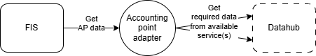
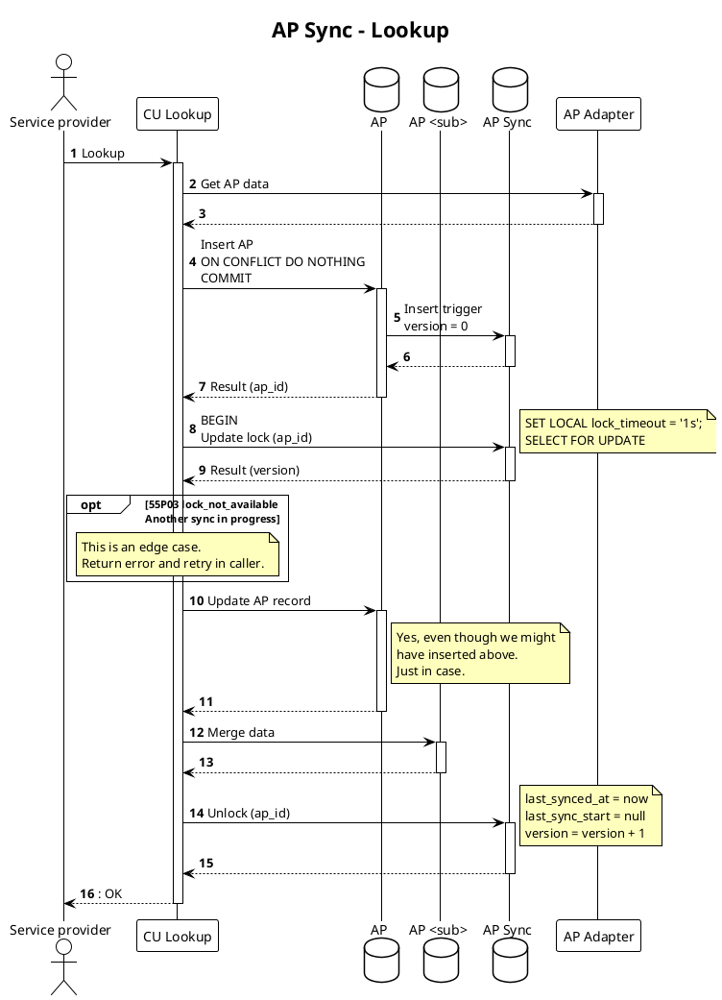

# Accounting point data from datahub

FIS relies on accounting point data to

* do authorization
* check consistencies
* aid prequalification
* and more

This data is assumed to be mastered and maintained in an external system. In
Norway, this is in the national datahub, Elhub.

Accounting point data is fetched from the datahub and loaded into the FIS
database. We need to provision a local copy to be able to efficiently use the
data in the FIS. We only fetch data for accounting points that are relevant,
meaning those that have controllable units connected to them. The most important
reason for this is data minimization in terms of data privacy. But it also helps
with the sync performance and reduces the amount of data we need to store.

Fetching and updating data must happen...

* in [Controllable Unit Lookup](../processes/controllable-unit-lookup.md) for
  accounting points not already in the system.
* on a regular basis to keep data in sync.
* when we receive events/notifications about changes to the data from the datahub.

It is the FIS that will reach out to the datahub for (updated) data.

## Adapter service

The [adapter pattern](https://en.wikipedia.org/wiki/Adapter_pattern) is a well-
known pattern when integrating data from external systems. In a data
synchronization use case like this, it is basically about mapping/translating
the data/API.

The way we leverage the adapter pattern for fetching accounting point data is
that we expect that a separate adapter _service_ is available for the FIS to
call. The adapter service is responsible for the conversion of the external
API/data into a format that is expected in our bounded context.

The diagram below illustrates the relationship between the FIS, the adapter and
the datahub.

The reason for keeping this responsibility outside of the FIS is that
depending on what country/context the system is deployed in, the data may be
sourced from different places with widely different source formats/APIs.

### API Contract

The adapter service must implement the OpenAPI document defined in
[backend/accountingpoint](https://github.com/elhub/flex-information-system/tree/main/backend/accountingpoint/static/openapi.yml).

### Authorization

Since the adapter service is assumed to be specifically deployed for the FIS, a
shared API Bearer key is configured on both sides.

## Event based provisioning

As of now, we do not have a technical implementation or design in place for
[event based
provisioning](https://docs.sikt.no/docs/datadeling/god-praksis/integrasjonsmonster/hendelsesbasert/)
of data. But the strategy that we will follow is that _thin_ events will be made
available to the FIS, which then is required to fetch the actual data, using the
adapter.

Wether these events will be pushed to FIS by the adapter or made available for
pull based mechanisms will be part of a future design.

## Data synchronization

Data synchronization happen "one accounting point at a time". It will
happen ad hoc (lookup) and on a regular basis (background job).

Data is fetched from the adapter and _merged_ into the FIS database
directly in the `flex.accounting_point*` tables.

Since data is fetched per metering point, pessimistic locking must be done to
avoid concurrent syncs of the same metering point. This is done with `SELECT FOR
UPDATE SKIP LOCKED` semantics on the relevant accounting points in
`flex.accounting_point`.

To faciliate batch synchronization, the `flex.accounting_point` table has a
`last_synced_at` timestamp column that is updated on each sync. This allows us
to identify which accounting points need to be synced in the background job.
This column is not tracked in the `flex.accounting_point_history` table since it
is just noise.

A nullable `last_sync_start` timestamp is used to track if a sync is currently
in progress. This is used to avoid starting multiple syncs of the same
accounting point, and to be able to identify "dead" syncs that have been
running for too long.

This shows diagram tries to show how the synchronization process works.

### Lookup flow

