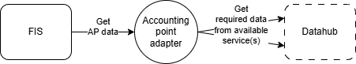
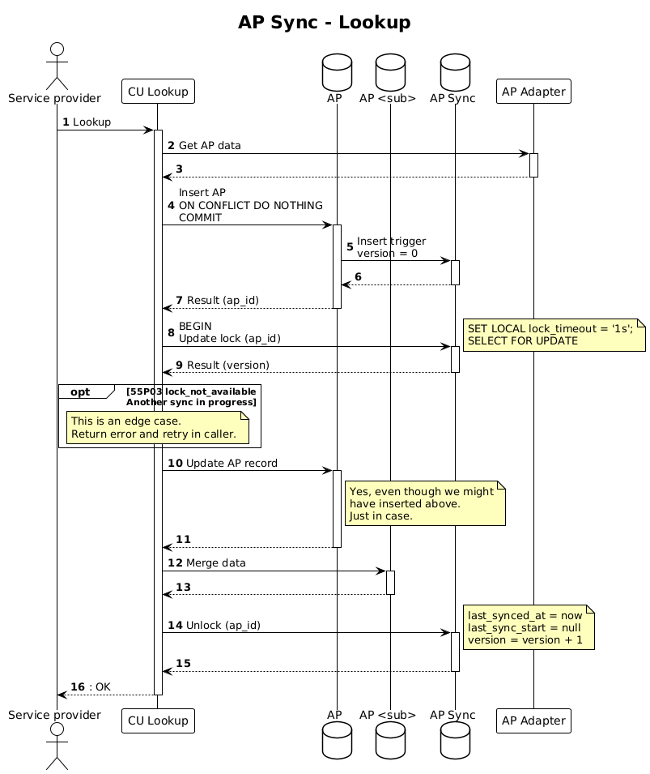
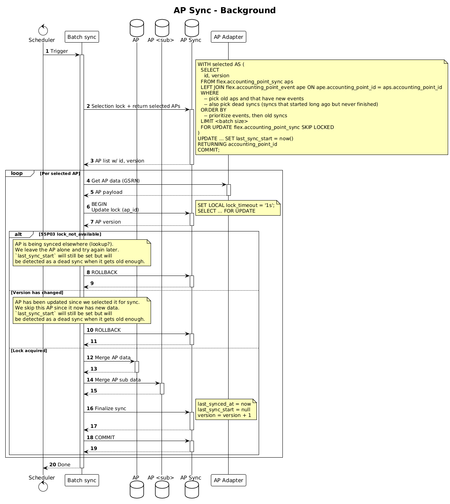
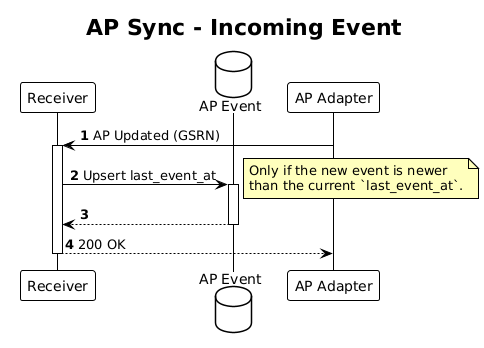

# Accounting point data from datahub

FIS relies on accounting point data to

* do authorization
* check consistencies
* aid prequalification
* and more

This data is assumed to be mastered and maintained in an external system. In
Norway, this is in the national datahub, Elhub.

Accounting point data is fetched from the datahub and loaded into the FIS
database. We need to provision a local copy to be able to efficiently use the
data in the FIS. We only fetch data for accounting points that are relevant,
meaning those that have controllable units connected to them. The most important
reason for this is data minimization in terms of data privacy. But it also helps
with the sync performance and reduces the amount of data we need to store.

Fetching and updating data must happen...

* in [Controllable Unit Lookup](../processes/controllable-unit-lookup.md) for
  accounting points not already in the system.
* on a regular basis to keep data in sync.
* when we receive events/notifications about changes to the data from the datahub.

It is the FIS that will reach out to the datahub for (updated) data.

## Adapter service

The [adapter pattern](https://en.wikipedia.org/wiki/Adapter_pattern) is a well-
known pattern when integrating data from external systems. In a data
synchronization use case like this, it is basically about mapping/translating
the data/API.

The way we leverage the adapter pattern for fetching accounting point data is
that we expect that a separate adapter _service_ is available for the FIS to
call. The adapter service is responsible for the conversion of the external
API/data into a format that is expected in our bounded context.

The diagram below illustrates the relationship between the FIS, the adapter and
the datahub.



The reason for keeping this responsibility outside of the FIS is that
depending on what country/context the system is deployed in, the data may be
sourced from different places with widely different source formats/APIs.

### API Contract

The adapter service must implement the OpenAPI document defined in
[backend/accountingpoint](https://github.com/elhub/flex-information-system/blob/main/kbackend/src/main/kotlin/no/elhub/flex/integration/accountingpointadapter/openapi.yaml).

### Authorization

Since the adapter service is assumed to be specifically deployed for the FIS, a
shared API Bearer key is configured on both sides.

## Event based provisioning

As of now, we do not have a technical implementation or design in place for
[event based
provisioning](https://docs.sikt.no/docs/datadeling/god-praksis/integrasjonsmonster/hendelsesbasert/)
of data. But the strategy that we will follow is that _thin_ events will be made
available to the FIS, which then is required to fetch the actual data, using the
adapter.

Whether these events will be pushed to FIS by the adapter or made available for
pull based mechanisms will be part of a future design.

## Data synchronization

Data synchronization happens "one accounting point at a time". It will
happen ad hoc (lookup) and on a regular basis (background job).

Data is fetched from the adapter and _merged_ into the FIS database
directly in the `flex.accounting_point*` tables.

There are a number of things that can happen concurrently that we need to take
into account when doing the sync. These are:

1. Multiple lookups, possibly on the same accounting point, on both new and
   previously synced accounting points. Lookup must write to the database to be
   able to return internal identifiers (AP and EU) to the caller.
2. Incoming events that tell us that accounting points have been updated in the
   datahub and should be synced.
3. Multiple background syncs that are running on a schedule, from separate
   workers/instances. These should pick up accounting points that we know have
   been updated in source (priority) or have not been synced in a while, and
   sync them.

> [!NOTE]
>
> The design here does not take into account removal of accounting points. It is
> not expected to happen on any time soon. Removal of accounting points from FIS
> is only relevant if we need to delete data for privacy reasons, e.g. old data
> that we no longer have a legal basis to keep or possibly due to data deletion
> requests from data subjects. This is not expected to be a common occurrence
> and will not be discussed in this document/design as of now.

To enable this concurrent processing, we utilise a combination of [isolation
levels](https://www.postgresql.org/docs/current/transaction-iso.html) and
pessimistic locking. The locks are held on a separate locking table using
different
[clauses](https://www.postgresql.org/docs/16/sql-select.html#SQL-FOR-UPDATE-SHARE)
and
[modes](https://www.postgresql.org/docs/16/explicit-locking.html#LOCKING-ROWS)
depending on the use case. We avoid deadlocks using
`SET LOCAL lock_timeout = '1s'` and/or `NOWAIT|SKIP LOCKED`.

1. `Update lock` - When actually writing updates to the database, to avoid
   concurrent writes of the same accounting point. This lock is held for the
   duration of the transaction/update. Lock timeouts are used to avoid deadlocks.
2. `Selection lock` - When picking up accounting points to sync in the
   background job, to avoid picking up the same accounting point in multiple
   workers/instances. This uses a standard `SELECT FOR UPDATE SKIP LOCKED`
   clause with CTE. This lock is held only for the duration of the selection
   where we mark the accounting points as in progress.

In addition to this, we use optimistic locking with a version column to detect
races between lookups and background syncs.

Since data is fetched per accounting point, pessimistic locking must be used to
avoid concurrent syncs of the same accounting point.

We use a separate synchronization table for this process:

* `flex.accounting_point_sync` - handles update and selection locks for the
  accounting point sync process, tracks sync status (`last_synced_at`,
  `last_sync_start`), and stores event priority signal (`last_event_at`).

We keep this state separate from the main accounting point data to keep the
sync flow and locking logic isolated.

To facilitate batch synchronization, the `flex.accounting_point_sync` table has
a `last_synced_at` timestamp column that is updated on each sync. A nullable
`last_sync_start` timestamp is used to track whether a sync is currently in
progress. This is used to avoid starting multiple syncs of the same accounting
point, and to be able to identify "dead" syncs that have been running for too
long. The version column is used for optimistic locking to detect races.

The following sections outline how the different flows work and how the locking
is used in each of them.

The following participants are involved in the flows:

* `Service Provider` - the external caller
* `CU Lookup` - the functionality in FIS that provides CU lookup
* `Batch Sync` - the background sync process that runs on a schedule to keep
  data in sync
* `AP` - the `flex.accounting_point` table
* `AP Sync` - the `flex.accounting_point_sync` table
* `AP <sub>` - tables that hold time dependent AP data - e.g.
  `flex.accounting_point_energy_supplier`
* `AP Adapter` - the adapter service that provides AP data from the datahub
* `Receiver` - the functionality in the FIS that receives incoming events about
  AP updates from the AP adapter

### Lookup flow



### Background sync flow

The batch size for the background sync can be established upon application
startup. We generally want all accounting points to be synced within 24 hours.
The batch size should be configured as follows. We can use startup since
we assume that we will deploy/recycle the application quite often.

```none
Batch size = nb_accounting_points / ((24h / interval) * nb_workers)
```

We can make this better in the future, but for now we can live with this simple
approach.

Our goal is either way that we want to spread the load out during the whole day,
and not have a big batch of syncs running at the same time. This is to avoid
putting too much load on the source system.



### Incoming events

Incoming events update `last_event_at` in `flex.accounting_point_sync`, which
is used to prioritize accounting points in the background sync. Event processing
is lightweight and only updates this sync metadata.


