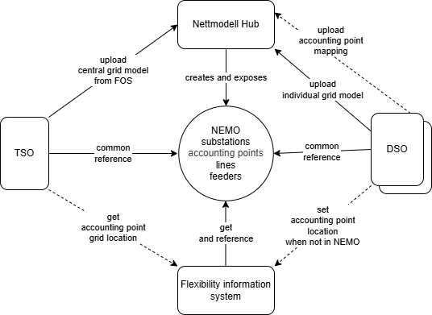
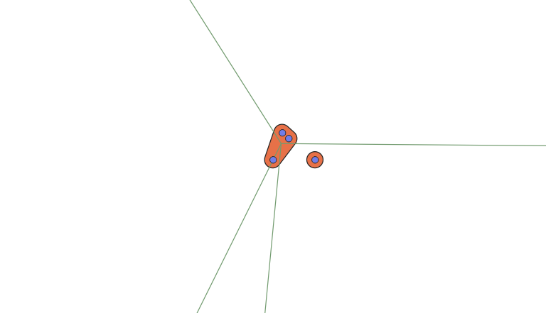
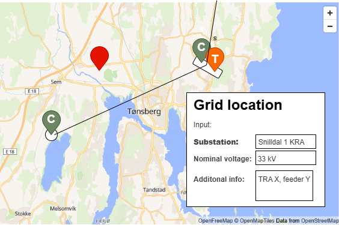

# Accounting point grid location

This document shows how location for accounting points are handled in the
flexibility register. The location is used in the [grid-model
use-cases](../concepts/grid-model.md).

Grid location means the *electrical* or *topological* location in the grid. This
is different from the geographical location, given as coordinates or address.

Since a controllable unit is always "behind" an accounting point, the grid
location on accounting point will give the location for the CUs as well.

## Accouting point geographical location

The accounting point geographical location is loaded as part of the [accounting
point data sync](../accounting-point-data-sync.md). This location is used for
displaying the accounting point on a map to visually aid the DSO in picking the
right grid location.

Since we also know the geographical location of the different parts of the grid
model, we can also use the geographical location of the accounting point to make
an educated guess on the grid location.

## Common grid model as reference

The grid location of accounting points is used to facilitate collaboration and
coordination between grid owners on different levels. An example is that a
regional or transmission system operator needs to know the grid location of a
controllable unit connected in a distribution system operators grid to be able
to assess if activation of flexibility services will compromise safe operation
of their grid.

To be able to communicate efficently, both the connecting and impacted/procuring
system operator must have a common reference - a common grid model that they can
use to communicate location.

This also means that each system operator must have a mapping or connection from
their individual grid model to a common grid model.

The Norwegian common grid model is [Nemo](https://nemo.elbits.no/modell/) from
[Elbits](https://www.elbits.no/).

Nemo is used by [Tilko](https://www.elbits.no/tjenester/tilko), a digital portal
for grid connection requests that affects more than one grid owner. Tilko has
been rolled out to almost all of Norway as of writing this. We are taking a lot
inspiration from Tilko in how we exchange grid location.

### Accounting points in grid model

Work is ongoing to add accounting points to the common grid model. This will be
done in one of two ways:

* combining the individual grid models of TSO and DSO and traversing the grid to
  set location
* DSOs doing the mapping in their NIS and exporting the grid location directly
  for inclusion in the common grid model

Once this is in place, this will become the authoritative source of grid
location for accounting points. It is assumed that the information will be added
gradually - system operator by system operator.

Accounting points will point to the most specific point in the grid model as
possible. This could be a substation, transformer or feeder.

The flow of information can be visualised as follows.

## Grid model service

Grid model data will be made available as its own service in the flexibility register.
The grid model service will serve data as an aid in picking the grid location.

We model a condensed data model with the following resources in this service,
based on Nemo.

* `substation` from `Substation` and `SubstationPart`
* `line` from `Line`

### substation

The `substation` resource is modelling
[elb:SubstationPart](https://nemo.elbits.no/modell/Dokumentasjon/substationpart/)
and [cim:Substation](https://nemo.elbits.no/modell/Dokumentasjon/substation/) as
a single resource. This is based on a understanding that the substationpart as a
name/concept will not be used in future versions of a common grid model.

We use substation kind and a foreign key to distinguish between the two. If the
substation does not have a kind, then it is a child substation. A child
substation will also have a foreign key to its parent substation.

The following fields exist on the substation resource

| Field name             | Description                                          | Format                                         | Example                                   | Nullable | Note                       |
|------------------------|------------------------------------------------------|------------------------------------------------|-------------------------------------------|----------|----------------------------|
| id                     | Surrogate identifier                                 | Integer                                        | 1234                                      | no       |                            |
| name                   | Name of the substation.                              | Free text                                      | Snilldal 1 KRA                            | no       |                            |
| business_id            | Business identifier for the substation - mRID        | UUID                                           | 1234                                      | no       |                            |
| business_id_type       | Type of business identifier.                         | `uuid`                                         | uuid                                      | no       |                            |
| kind                   | Kind of substation                                   | `coupling`, `junction`, `power`, `transformer` | coupling                                  | yes      |                            |
| substation_id          | Foreign key to parent substation.                    | Integer                                        | 1234                                      | yes      |                            |
| longitude              | Longitude of the substation.                         | Numeric                                        | 10.1234                                   | yes      | Center for parent          |
| latitude               | Latitude of the substation.                          | Numeric                                        | 63.1234                                   | yes      | Center for parent          |
| nominal_voltage_levels | List of voltage levels on the substation and parent. | Array of numeric. kV with three decimals.      | [22, 33]                                  | yes      | Extracted from BaseVoltage |
| consessionaires        | Name and org number of the main consessionaires.     | Array of free text                             | ["SønderEnergi Nett (987654321)"]         | yes      |                            |
| geometry               | For displaying on a map. GeoJSON Polygon or Point.   | GeoJSON Polygon or Point                       | See [GeoJSON Geometry](#geojson-geometry) | yes      |                            |

### line

| Field name           | Description                                      | Format             | Example                                   | Nullable | Note                       |
|----------------------|--------------------------------------------------|--------------------|-------------------------------------------|----------|----------------------------|
| id                   | Surrogate identifier                             | Integer            | 1234                                      | no       |                            |
| name                 | Name of the line.                                | Free text          | Snilldal-Høyeng                           | no       |                            |
| business_id          | Business identifier for the line - mRID          | UUID               | 1234                                      | no       |                            |
| business_id_type     | Type of business identifier. Just `uuid`         | `uuid`             | uuid                                      | no       |                            |
| from_substation_id   | Foreign key to the substation the line starts at | Integer            | 1234                                      | no       |                            |
| from_nominal_voltage | Voltage level on the line. kV.                   | Numeric            | 22                                        | no       | Extracted from BaseVoltage |
| to_substation_id     | Foreign key to the substation the line ends at   | Integer            | 1234                                      | no       |                            |
| to_nominal_voltage   | Voltage level on the line. kV.                   | Numeric            | 22                                        | no       | Extracted from BaseVoltage |
| concessionaires      | Name and org number of the main concessionaires. | Array of free text | ["SønderEnergi Nett (987654321)"]         | yes      |                            |
| geometry             | For displaying on a map. GeoJSON LineString.     | GeoJSON LineString | See [GeoJSON Geometry](#geojson-geometry) | yes      |                            |

### GeoJSON Geometry

We are storing a [GeoJSON
geometry](https://datatracker.ietf.org/doc/html/rfc7946#section-3.1) for both
substations and lines. This is for displaying the grid model on a map.

This is how we derive the geometry.

| Nemo type      | Geometry type | Description                                                                                               |
|----------------|---------------|-----------------------------------------------------------------------------------------------------------|
| SubstationPart | Point         | We use the Location of the SubstationPart.                                                                |
| Substation     | Polygon       | The convex hull of the Location of the SubstationParts, with a fixed buffer.                              |
| Line           | LineString    | Line from center to center of to/from Substations. Center is the average of the SubstationPart locations. |

This allows us to display the three things. Shown in the example below. The
example shows two main substations. One has three childs and a few connecting
lines. The other one has just one and no connections. This should of course be
displayed on top of a map.

> [!NOTE]
>
> The Point geometry should probably use pins for location. That allows us to
> use different colors and icons/letters for different kinds of substations. See
> example below.

### Provisioning of data

We do a full load of the grid model data follwing the [structure data loading
mechanisms](./structure-data.md). We load using merge and update using the
automatic strategy.

Resources that we have previously loaded but is now not present in the current
load will be soft-deleted using a specific field on the resources.

## Location = Grid model reference + Voltage level

The grid owners registers the electrical grid location of an accounting point.
The location should be given as a reference to the common grid model. The
reference should also be given to the most specific point in the grid as
available.

The information is given in a dedicated resource
`accounting_point_grid_location` containing the following fields.

> [!NOTE]
>
> We are using business ids and free text names here on purpose. This is because
> we believe that in general system operators will communicate grid location
> directly, using NEMO as reference. Using FIS surrogate keys is not recommended
> in this context.

| Field name               | Description                                        | Format                               | Example        | Nullable | Note |
|--------------------------|----------------------------------------------------|--------------------------------------|----------------|----------|------|
| `grid_model_type`        | The type of object in the grid model               | `substation`, `transformer`          | substation     | no       |      |
| `grid_model_business_id` | Business ID (mRID) referencing national grid model | UUID                                 | 1234           | no       |      |
| `grid_model_name`        | Name of the grid model object                      | Free text                            | Snilldal 1 KRA | no       |      |
| `nominal_voltage`        | Voltage level in kV                                | Numeric value                        | 22             | no       |      |
| `additional_information` | Additional information about the grid location     | Free text                            |                | yes      |      |
| `source`                 | Who the grid location was determined by            | `cso`, `iso`, `grid_model`, `system` | cso            | no       |      |
| `quality`                | The quality of the grid location registration      | `confirmed`, `guessed`               | confirmed      | no       |      |

### Location source

As seen by the `source` field in the table above, we also want to keep track of
how the grid location was determined. The enum values are as follows.

* `cso` - registered by connecting system operator (CSO)
* `iso` - registered by impacted system operator (ISO)
* `grid_model` - given from common/national grid model
* `system` - (guessed) by the flexibility information system

The CSO is responsible for registering and updating the grid location. This is
done directly in the flexibility register or via the national grid model.

A impacted system operator (ISO) can also register the grid location, but only
if it is missing or the current information is determined by system or guessed
by another impacted system operator (ISO). The purpose of this is to allow the
ISO to improve on system-guessed location while waiting for confirmation from
the CSO. The procuring system operator (PSO) is considered to be a ISO in this
context.

The system will guess the grid location based on the geographical location of
the accounting point and the grid model. The system will only guess the grid
location if it is missing or the current information is determined by system.

The following table shows what transitions are allowed to update the grid
location based on the current source.

| Current ↓ \ New → | `grid_model` | `cso` | `iso`                 | `system` |
|-------------------|--------------|-------|-----------------------|----------|
| `grid_model`      | yes          | no    | no                    | no       |
| `cso`             | yes          | yes   | no                    | no       |
| `iso`             | yes          | yes   | if current is guessed | no       |
| `system`          | yes          | yes   | yes                   | yes      |
| missing           | yes          | yes   | yes                   | yes      |

The table shows that the priority order of the source is `grid_model` > `cso` >
`iso` > `system`.

> [!NOTE]
>
> Note that transformer is part of the location but not discussed above. We are
> still debating if/when transformers should be part of the grid location.

## Guessing grid location

Since we know the geographical location of the accounting point and substations,
we can make an educated guess on the grid location.

The first implementation just pick the closest. But we assume that we will
create more elaborate strategies once we see it in action.

## Example user interface

This shows an example of how the grid location UI can be in a flexibility register.

## Voltage level standardisation

Voltage levels in Nemo are all-over-the-place. For simpler user interaction, we
might want to standardise voltage levels. The way we do it it is by combining
ranges into a single nominal voltage level. The following table shows the
thresholds and which nominal voltage level it maps to. If a voltage level equal
or higher than a threshold, and lower than the next, then it maps to the given
nominal voltage. All voltages are given as as kilovolt (kV).

| Threshold | Nominal |
|-----------|---------|
| 0         | 0.23    |
| 0.34      | 0.4     |
| 0.6       | 0.69    |
| 0.8       | 1       |
| 2         | 3.3     |
| 4         | 5       |
| 5.5       | 6.6     |
| 8         | 11      |
| 12        | 15      |
| 18        | 22      |
| 27        | 33      |
| 40        | 47      |
| 55        | 66      |
| 80        | 110     |
| 120       | 132     |
| 200       | 300     |
| 350       | 420     |

This topic is still up for discussion.
