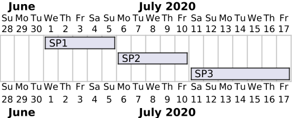
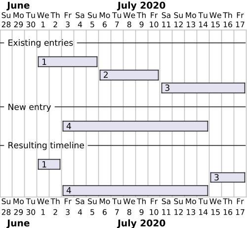
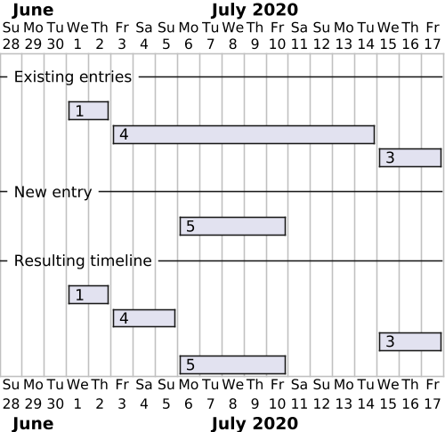

# API Design

TLDR;

> The Flexibility Information System API is a
> `Resource-oriented JSON-over-HTTP(s) Data API`.

## Design goals

Our design goals are

* simple and clear
* easy to use - APIs are for humans (developers)
* simple to maintain
* cache friendly (including invalidation)
* well-documented
* discoverable
* facilitates gradual rewrite from postgREST to a custom API implementation

## JSON over HTTPS

We use JSON as the data format and HTTPS as the transport protocol. JSON is
the de-facto standard for data exchange on the web. It is light-weight, fairly
easy to read and versatile. It is not as rich as XML and simple as CSV, but
basically all tooling around web APIs support JSON.

## Synchronous and stateless

We use a synchronous request-response model. This means that the client sends a
request to the server and waits for a response. The server processes the request
and sends a response back to the client.

This is in contrast to the asynchronous models e.g. in the Elhub API (EMIF)
where the client needs to poll the server for responses separately from the
request.

## Resource-oriented

We rely on
[resource-oriented design](https://cloud.google.com/apis/design/resources) when
designing our api.

> Its core principle is to define named resources that can be manipulated using
> a small number of methods. The resources and methods are known as **nouns** and
> **verbs** of APIs.

Nouns are (collections of) resources, and verbs are realized via a combination
of path and HTTP method. We do **not** use Remote Procedure Call (RPC) style paths.
An example can be a `controllable_unit`.

| Verb   | Path                    | HTTP Method | RPC Style              |
|--------|-------------------------|-------------|------------------------|
| Create | /controllable_unit      | POST        | CreateControllableUnit |
| List   | /controllable_unit      | GET         | ListControllableUnits  |
| Read   | /controllable_unit/{id} | GET         | ReadControllableUnit   |
| Update | /controllable_unit/{id} | PATCH       | UpdateControllableUnit |
| Delete | /controllable_unit/{id} | DELETE      | DeleteControllableUnit |

We do not use the `PUT` method simply because we do not need it.
This is in line with the design in the
[JSON:API spec](https://jsonapi.org/faq/#wheres-put).

In case of actual RPC style methods, we use the `Call` verb.

[typicode/json-server](https://github.com/typicode/json-server) is very simple
api design that has been used as a reference.

## Common fields

We implement a few common fields on all resources. These are

| Field         | Type                     | Description                                              |
|---------------|--------------------------|----------------------------------------------------------|
| `id`          | bigint                   | Unique identifier                                        |
| `recorded_at` | timestamp with time zone | Time the resource was last recorded (created or updated) |
| `recorded_by` | bigint                   | Id of the identity that last recorded the resource       |

## History

We provide history as a separate resource on the api. The history resource
provide the same fields as the main resource, but with the addition and
adjustments of a few of the fields.

| Field           | Type                     | Description                                   |
|-----------------|--------------------------|-----------------------------------------------|
| `id`            | bigint                   | Unique identifier of the *historic record*    |
| `<resource>_id` | bigint                   | Id of the resource that this history is for   |
| `replaced_at`   | timestamp with time zone | Time the resource was replaced                |
| `replaced_by`   | bigint                   | Id of the identity that replaced the resource |

The history records are available via a resource path that appends `_history` to
the resource name. Example for `controllable_unit`.

The only allowed action/method is `read`/`GET`.

| Path                                                      | Methods | Description                                           |
|-----------------------------------------------------------|---------|-------------------------------------------------------|
| `/controllable_unit_history`                              | GET     | List all history records                              |
| `/controllable_unit_history/{id}`                         | GET     | Get a specific history record                         |
| `/controllable_unit_history?controllable_unit_id=eq.{id}` | GET     | List history records for a specific controllable unit |
| `/controllable_unit/{id}/history`                         | GET     | Redirects (`307`) to the path shown above.            |

## Events and notifications

Every resource modification in the system leads to an *event* being recorded.
Events contain data identifying precisely which *resource* was touched and what
is the *nature* of the modification done.

The server then turns events into *notifications* that the user can read and
acknowledge as part of the processes supported by the Flexibility Information
System.

[Events](../resources/event.md) and [notifications](../resources/notification.md)
are reachable in the API as regular resources like the others, *i.e.*, through
the `/event` and `/notification` endpoint families.

## Notices

Strongly enforcing consistency and closely following processes is a *hard* task
in a system that is optimised for change and where users can make *mistakes*.

In order to store decently reliable data while still keeping a maintainable
system in the long run, we generally make sure that *new* data entering the
system are consistent with existing data, but we tolerate some level of
*temporary* inconsistency or invalidity for some resources. This has several
advantages, such as *sparing* us the need for advanced *rollback* mechanisms.

However, even if we do not enforce it as strictly in the database, we consider
that such issues *should* be fixed eventually. This is the purpose of the
[*notice*](../resources/notice.md) resource. It detects inconsistencies or
invalid states in ongoing processes and exposes them through the API for each
user to see what actions on the system are expected from them. This allows
making mistakes but also detecting and fixing them in a decent time, ensuring
*eventually strong* consistency between the resources in the system in a
flexible way.

## Time dependent resources and fields

Some resources or fields are [time dependent](time.md). We model timelines as a
collection of resources with valid time intervals defined by `valid_from`
(inclusive) and `valid_to` (exclusive). If a field is time-dependent, we model
it as a separate resource.

In the following sections we will use an example of `controllable_unit` that has
a `service_provider` relation that changes over time. This is modelled as a
separate resource `controllable_unit_service_provider`. In a tabular layout it
looks like this:

| id | controllable_unit_id | service_provider_id | valid_from | valid_to   |
|----|----------------------|---------------------|------------|------------|
| 1  | 1                    | 1                   | 2020-07-01 | 2020-07-06 |
| 2  | 1                    | 2                   | 2020-07-06 | 2020-07-11 |
| 3  | 1                    | 3                   | 2020-07-11 | null       |

The `controllable_unit_id` identifies a distinct timeline, while a specific
entry is identified by the `id`.

The following diagram shows how
these three entries are layed out in the timeline.



### Reading a timeline

If you want to see all entries in a timeline you need to query the collection
with a filter that identifies the timeline. For our example, that means a
specific `controllable_unit_id`, so the operation would look something like
this:

> **GET** /controllable_unit_service_provider?controllable_unit_id=eq.1

### Adding a new or updating a entry to the timeline

When adding a new entry to the timeline, you basically add a new resource like
with other collections. However, the create operation will also modify or delete
other entries to ensure a non-overlapping timeline.

Say we want to add the following entry to our example timeline:

```json title="POST /controllable_unit_service_provider"
{
    "controllable_unit_id": 1,
    "service_provider_id": 4,
    "valid_from": "2020-07-03T00:00:00.000Z",
    "valid_to": "2020-07-15T00:00:00.000Z"
}
```

The following diagram shows the timeline before and after adding the entry. The
entries are identified by the id.



As shown, entry `2` is removed and entry `1` and `3` is modified to fit with the
new resource.

If the new entry is fully overlapped by an existing entry, then the create
will result in a gap in the timeline. As seen in the following diagram, entry
`4` is modified and limited to the start of the new entry `5`, leaving a gap
between `5` and `3`.



Updating a entry is similar to adding a new entry. If the valid time range is
increased, then other entries will be modified or deleted to ensure a
non-overlapping timeline.

If you want to update a resource, like set an end date on the current relation
(where `valid_to` is null), then you would do a update operation on that specific
resource.

```json title="PATCH /controllable_unit_service_provider/3"
{
    "valid_to": "2020-08-15T00:00:00.000Z"
}
```

!!! note "Gaps are allowed"

    The update mechanisms does not care about gaps in the timeline, they are
    generally allowed. This means that the logic does not adjust the timeline
    (i.e. update other entries) if a entry is deleted or its valid time is
    decreased.

### History on time-dependent resources

We provide history on time-dependent resources as well. This follows the same
pattern as the [regular history](#history). Time dependent resources with
history provides [bi-temporal](../technical/time.md#bi-temporal-data) data.

### Restoring a timeline

Restoring a timeline is done with regular updates. You would need to do a
`PATCH` operations on the specific entries. The typical workflow would be:

1. List the history of the timeline (possibly filtered by record time)
2. Find the history entries that should to be restored
3. Do a `PATCH` operation on the specific entries with the old data to restore it

Deleted entries are only soft-deleted in the system by setting `valid_from` and
`valid_to` as null. These resources also accept `PATCH` operations. A `PATCH` to
restore a deleted resource requires that the `valid_from` is set to a non-null
value.

!!! note "No revert or rollback operations"

    We do **not** provide a revert operation that restores a timeline to a specific
    point in time. Restore must be done on the individual entries in sequence.

    We do **not** provide a rollback operation to undo all the changes that
    occurred due to a specific `PATCH` or `POST`. Rollback operations are hard
    to get right in situations where there could be multiple changes to the
    timeline since the point in time you want to rollback to.

## Rich text fields

Some text fields actually support *rich text* content. For simplicity, we chose
HTML as the format of rich text fields, as it is a very common format readily
available in all web browsers, which are likely to be the host of the frontend
environments that will interact with our API.

In such cases, where data stored in a system must be *interpreted* in order to
be displayed, this data should always go through a *sanitisation* step before
being used. This sanitisation can happen one or several times, before storing
the data or after retrieving it. For now, rich text fields are a test feature,
so we choose not to validate their content on the server side. It is therefore
left to the responsibility of our users to sanitise the content of rich text
fields before exploiting it. Note that the default user interface we offer as
part of our test platform use components performing the expected sanitisation.

## Naming and casing

Singular vs plural is basically a matter of taste. We just had to pick one. We
use singular names on all resources. This is a design choice to make the
API more consistent with the data model in the database, where the
[singular names are nice](https://stackoverflow.com/a/5841297).

Another way we make the API consistent with the database is by using
`snake_case` for resource/collection, field names and enumerations. This allows
us to have the same name across all layers.

## Identifiers

We use `id` as the primary [identifier](./identifiers.md) for all resources. The
`id` is a unique integer generated by a sequence in the system. It is a
[surrogate key](https://en.wikipedia.org/wiki/Surrogate_key).

Where relevant we also store natural keys or other identifiers on the
resources. If so, these are usually stored in a field name `business_id`. If the
resources support multiple types of identifiers, we include a `business_id_type`
field as part of the identifier.

Finding a resource by this identifier can be done by filtering on the
`business_id` field. E.g. `GET /controllable_unit?business_id=eq.123456`.

## Discoverability and documentation via OpenAPI 3.1.0

Provide discoverability via OpeanAPI 3.1.0 document and generated documentation.
We are using 3.1 over 3.0 due to the full support of JSON Schema.

We are following a spec-first approach where we define the API in an OpenAPI
document first and implement later. This allows us to switch implementations
while having a stable api/document. It comes at the cost of having to maintain
the document manually. This maintenance is however eased through the use of
templating to avoid repeating ourselves and making mistakes. Templating also
normalises the API by making sure similar operations lead to similar endpoints.

## Note on RESTful and HATEOAS

We cannot talk about API design without talking about RESTful APIs and HATEOAS.

**REST** stands for **RE**presentational **S**tate **T**ransfer. RESTful APIs
are APIs that adhere to the REST architectural constraints. First coined by Roy
Fielding in his doctoral dissertation, REST is a set of constraints that, when
followed, enable a loose coupling between clients and servers. This loose
coupling is achieved by having the server send hypermedia links to the client,
which the client can then use to navigate the API. This is known as **HATEOAS**,
or **H**ypermedia **A**s **T**he **E**ngine **O**f **A**pplication **S**tate.

Implemeting a RESTful API is not easy, and most APIs that claim to be RESTful
are not. For some good reading on this topic, check out the following links:

* [Hypermedia APIs vs Data APIs](https://htmx.org/essays/hypermedia-apis-vs-data-apis/)
* [REST APIs must be hypertext-driven](https://roy.gbiv.com/untangled/2008/rest-apis-must-be-hypertext-driven)

We believe that RESTful APIs are really powerful, but complex. The true value of
a RESTful API is
[evolveability](https://twitter.com/fielding/status/376835835670167552). On the
[Richardson Maturity Model](https://martinfowler.com/articles/richardsonMaturityModel.html)
that evolveability is only achieved at level 3, with a true Hypermedia API. For
that to work, we put a lot of constraints on clients. As an example, our clients
would not be able to rely on fixed resource names or hierarchies.

We are aiming for level 2 on the Richardson Maturity Model. We are ok with a
higher degree of coupling between clients and servers.

But we try not to call our API REST or RESTful since the terms have very different
meanings depending on who you ask. We are calling our API style a
`Data API`.

## Links

One of the major benefits of the REST architectural style is that links are very
explicit by being part of the response. Our API does not return links, but
we provides information on how to navigate the API in the
documentation. The
[OpenAPI spec is a bit limited](https://github.com/OAI/OpenAPI-Specification/issues/1327)
in this regard. The
[Link Object](https://spec.openapis.org/oas/v3.1.0#link-object) also doesn't
display well (or at all) in the generated docs tools.

We provide a `links` object in the  `20*` response to `Read` requests, but omit
it in `List`, `Create` and `Update` requests. This is just to limit the amount
of toil/busywork related to maintaining the OpenAPI document.

We also document the link as part of the textual field description in the OpenAPI
schemas.
