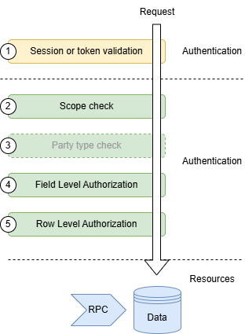
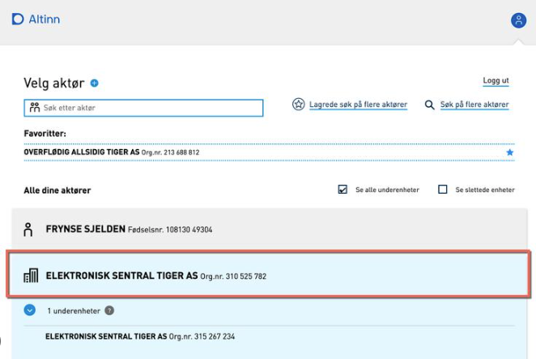
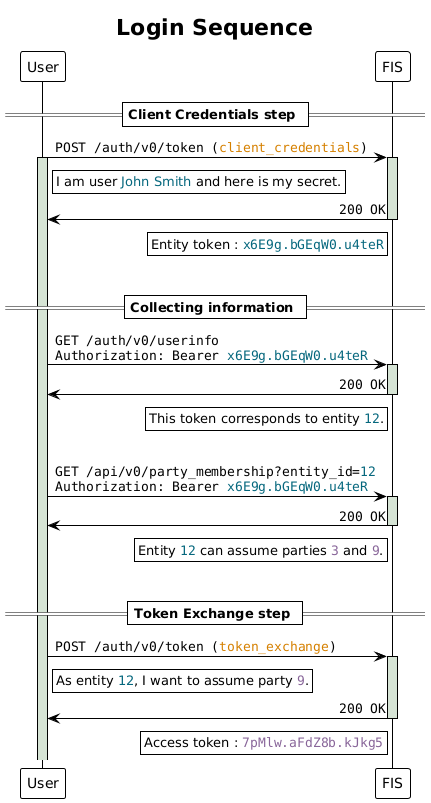
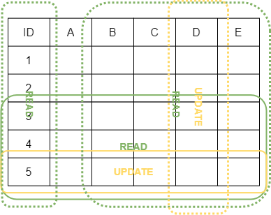
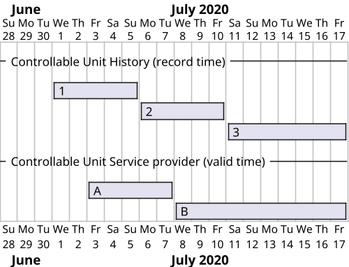
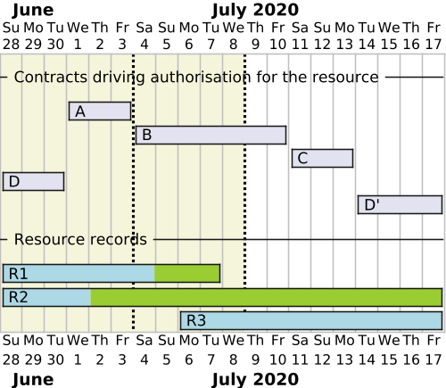

# Auth

This document describes the authentication and authorization model, principles
and concepts we are following in the Flexibility Information System. It is a
quite comprehensive document and contains alot of nitty-gritty details - even
about implementation. We are using it both as a design document and
documentation. You can use it as a reference and for understanding how we are
doing things.

The document assumes that you have some basic knowledge around the topic, such
as the distiction between authentication and authorization, but we will try to
add external links to relevant resources where appropriate (like we just did 😉).

> [!NOTE]
>
> We use _auth_ as a short form for _authentication and authorization_ in this
> document.

## Overview

We think of auth as a layered system, where each layer has a specific purpose
and responsibility. The layers are independent of each other and a request is
required to pass all the layers to be allowed access. The following diagram
shows the layers we have in our model.



The layers in the auth model are there to protect our resources. These resources
take the form of data or remote procedure calls (RPCs) in our APIs. You can
think of a resource as a path in our API, e.g. `/api/v0/controllable_unit/`.
Authorization protects what actions (create, read, update, delete, call) the
user can do on the resources.

1. **Session or token validation** - This is how we authenticate the user. Once
   authentication is done we know the entity, party and scopes of the user. If
   there is no session or token the user enters the system as an anonymous user
   with read access.
2. **Scope check** - Empty scope means no access. The scope check validates actions
   on resources, e.g. does the user have the scope to do update on this
   resource.
3. **Party type check** - Actions on some resources might only be accessible for
   certain party types, like the `Flexibility Information System Operator` or
   `System Operator`. For these resources we have an explicit party type check
   for additional security, e.g. is the party type of the user allowed to do
   call this resource. We typically use this on RPC resources.
4. **Field Level Authorization** - FLA controls access for the combination of
   party type, action and fields, e.g. can this party type update these fields on
   this resource.
5. **Resource Level Authorization** - RLA controls access for the specific party
   and resource, e.g. can this party delete this resource.

Read more details about the layers further down in this document.

## Actions

When we talk about authorization we usually talk about performing "actions" on
resources or fields. The table below shows the actions and their corresponding
[HTTP methods](https://developer.mozilla.org/en-US/docs/Web/HTTP/Methods) and
[database grants](https://www.postgresql.org/docs/15/sql-grant.html).

| Action     | HTTP verb | Database grant | Usage                        |
|------------|-----------|----------------|------------------------------|
| **C**reate | POST      | INSERT         |                              |
| **R**ead   | GET       | SELECT         |                              |
| **U**pdate | PATCH     | UPDATE         |                              |
| **D**elete | DELETE    | DELETE         |                              |
| **C**all   | POST      | EXECUTE        | Used for RPC type endpoints. |

We do not model `List` as a specific action even tho it is a verb - someting a
user can do - on the [API](api-design.md). It is covered by `Read`.

## OAuth 2.0 and OpenID Connect standards

We are relying on the patterns and flows established as part of multiple RFCs
related to OAuth 2.0 as well as
[OpenID Connect](https://openid.net/specs/openid-connect-core-1_0.html).
Relevant RFCs are listed below, but you can also check the
[map of OAuth 2.0 specs from Okta](https://www.oauth.com/oauth2-servers/map-oauth-2-0-specs/).

* [RFC6749 - The OAuth 2.0 Authorization Framework](https://www.rfc-editor.org/rfc/rfc6749)
* [RFC6750 - The OAuth 2.0 Authorization Framework: Bearer Token Usage](https://www.rfc-editor.org/rfc/rfc6750)
* [RFC7636 - Proof Key for Code Exchange by OAuth Public Clients](https://datatracker.ietf.org/doc/html/rfc7636)
* [RFC7523 - JSON Web Token (JWT) Profile for OAuth 2.0 Client Authentication and Authorization Grants](https://datatracker.ietf.org/doc/html/rfc7523)
* [RFC8693 - OAuth 2.0 Token Exchange](https://datatracker.ietf.org/doc/html/rfc8693)

The implementation
follows only parts of these standards, but we are trying to comply with the
specification for the parts we actually implement.

We are also relying heavily on the JOSE (Javascript Object Signing and Encryption)
[suite of specifications](https://datatracker.ietf.org/wg/jose/about/).

!!! note "Distinct API for authentication"

    Note that authentication and the rest of the Flexibility Information System
    work as two _separate_ services, and as such, are exposed through _distinct_
    APIs. The endpoints can be reached by using the `/api` or
    `/auth/` prefixes in the URL used to access the Flexibility Information
    System APIs. In the rest of this page, we use the terms _main API_ and _auth API_
    to distinguish these distinct roots of API endpoints.

## Authentication model

In this section, we describe the authentication model in the Flexibility
Information System.

### Identity

Any system or person interacting with the Flexibility Information System will
always be authenticated as a legal og natural _entity_, possibly assuming the
role of a market _party_. The entity and party together make up the _identity_
of the user.

The entity has very little functionality available in the system, most
functionality will be available after assuming a _party_. The identity of the
user is then the combination of the entity and the party they are acting as. As
a result, in order to interact properly with the Flexibility Information System,
an entity must assume a party.

Inspiration for this step is taken from [Altinn](https://info.altinn.no/en/),
where one is presented with a list of parties upon login. The Elhub portal also
has the same type of logical mechanism.

.

The concept is also inspired by [AWS AssumeRole](https://docs.aws.amazon.com/STS/latest/APIReference/API_AssumeRole.html).

Assuming a party is done using [Token Exchange](#token-exchange) or directly in
authentication using [JWT Bearer](#jwt-bearer) grant. To assume a party, the
entity must be a member of the party.

### Entity - individuals and organisations

The _entity_ is the natural or legal person using the system. This is the "raw"
identity of the user when it enters the system.

* [Natural entities](https://en.wikipedia.org/wiki/Natural_person) are
  _individuals_ identified by their national identity number (fødselsnummer) or
  D-number.
* [Legal entities](https://en.wikipedia.org/wiki/Legal_person) are
  _organisations_ identified by their organisation number (organisasjonsnummer).

In a production setting, the identity of the entity will be established through
mechanisms such as IDPorten, Maskinporten or enterprise certificates.

### Party - market actors

This is the market party like a system operator or service provider. Parties in
the European energy sector are typically identified by a GLN or `EIC-X`. After
being authenticated as an entity, the user can assume a party to
interact with the system.

We have two extra party types in addition to the other market actors: end users
and organisations.
An end user is either
[a person or an organisation](https://www.nve.no/reguleringsmyndigheten/regulering/kraftmarkedet/sluttbrukermarkedet/).
The organisation party is a way for the user to have access to a special role to
perform modifications on their own organisation entity.
They can for instance give total or partial (via delegation mechanisms) access
to what the entity owns and manages, to people from the same company.

We have the following party types in the Flexibility Information System:

| Abbreviation | Code                                    | Name                                    | Norwegian name                              |
|--------------|-----------------------------------------|-----------------------------------------|---------------------------------------------|
| BRP          | balance_responsible_party               | Balance Responsible Party               | _Balanseansvarlig_                          |
| EU           | end_user                                | End User                                | _Sluttbruker_                               |
| ES           | energy_supplier                         | Energy Supplier                         | _Kraftleverandør_                           |
| FISO         | flexibility_information_system_operator | Flexibility Information System Operator | _Fleksibilitetsinformasjonssystem Operatør_ |
| MO           | market_operator                         | Market Operator                         | _Markedoperatør_                            |
| ORG          | organisation                            | Organisation                            | _Organisasjon_                              |
| SO           | system_operator                         | System Operator                         | _Systemoperatør_                            |
| SP           | service_provider                        | Service Provider                        | _Tjenesteleverandør_                        |
| TP           | third_party                             | Third Party                             | _Tredjepart_                                |

!!! note "Common policies"

    In addition to these we also write policies and grant access that are common
    for all authenticated party types. This is referred to as `Common`,
    abbreviated as `COM`. All party types inherit the policies from `Common`.

The following sub-sections provides a brief description of each party type.

#### Balance Responsible Party

A party responsible for its imbalances.

Based on: [Consolidated text: Commission Regulation (EU) 2017/2195 - Art.2 Definitions](https://eur-lex.europa.eu/legal-content/EN/TXT/?uri=CELEX%3A02017R2195-20220619).

#### End User

Synonyms:

* _Final Customer_ (_Sluttkunde_)
* _Flexible Customer_
* _System User_

The entity at the lower end of the chain, willing to make their own technical
resources available on the flexibility market.

#### Energy Supplier

Synonyms:

* _Balance Supplier_
* _Supplier_

A party delivering to or taking energy from a party connected to the grid at an
accounting point.

#### Flexibility Information System Operator

Synonyms:

* _Flexibility Register Operator_

We use this as an administrator role for the Flexibility Information System, as
a last resort tool to have full authorisation on the system or perform special
operations.

#### Market Operator

Sub-types:

* _Local Market Operator_
* _Balancing Market Operator_

A party that provides a service whereby the offers to sell energy are matched
with bids to buy energy.

Based on: [Consolidated text: Regulation (EU) 2019/943](https://eur-lex.europa.eu/legal-content/EN/TXT/?uri=CELEX%3A02019R0943-20220623).

#### Organisation

This is not a market party as such but a party that represents the organisation
entity.

#### System Operator

Synonyms:

* _Grid Owner_

Sub-types:

* _Distribution System Operator_
* _Transmission System Operator_
* _Connecting System Operator_
* _Requesting System Operator_
* _Procuring System Operator_
* _Impacted System Operator_

A party responsible for operating, ensuring the maintenance of and, if
necessary, developing the system in a given area and, where applicable, its
interconnections with other systems, and for ensuring the long-term ability of
the system to meet reasonable demands for the distribution or transmission of
energy.

Based on: [Consolidated text: Directive (EU) 2019/944](https://eur-lex.europa.eu/legal-content/EN/TXT/?uri=CELEX%3A02019L0944-20220623).

#### Service Provider

Sub-types:

* _Balancing Service Provider_
* _Flexibility Service Provider_

A party that offers local or balancing services to other parties in the market,
after having successfully passed a qualification process.

#### Third Party

A party that does not have an actual responsibility in the value chain, but
_can be_ delegated authority to, _e.g._, perform tasks or access data.

### Roles

Parties in the Energy sector act in different "roles". For some examples, see
the
[Elhub role model](https://elhub.no/aktorer-og-markedsstruktur/aktorenes-roller/rollemodell/).
This level is mostly used for delegation. As of now, this level is **NOT** part of
the authentication or authorization model.

!!! note "The word 'role' can be seen in the system"

    Our database and API service does sometime refer to something called
    "roles". This is just how we model parties and entities in the system and is
    not related to the conceptual authentication or authorization model as
    described here.

### Anonymous users

Some data (like party lists) and actions (such as login) will be available for
un-authenticated users. We refer to these as `Anonymous`, abbreviated as `ANON`.

An anonymous user has the following default scopes:

* `data:read` - to be able to access open data (if any)
* `auth:use` - to be able to log in etc

!!! info "Policy inheritance"

    RLA policies for `Anonymous`/`ANON` are inherited by _all authenticated users_.

## Authentication methods

Authentication is the process of establishing the "raw" identity of the user.
For us, this means identifying the _entity_, i.e. the individual or organisation
using the system. We provide different ways of authentication, depending on how
you want to interact with the system.

Individuals what want to log into the portal will log in using the
`OpenID Connect` protocol with an identity provider. In a production setting the
identity provider will be IDPorten.

Entities that want to use the API will have to create and attach clients to
their entity resource in the system. Creating a client generates a unique
identifier and allows setting a password and/or a public key associated to this
client. From there, users have two ways of authenticating.

* `JWT Bearer` - The entity uploads a public key to one of its clients and uses
  a self-signed JWT Authorization grant to authenticate.
* `Client Credentials` - The entity uses a client_id and client_secret to
  authenticate. The client_id is the UUID of one of the clients added by the
  entity in the system, and client_secret is basically a password that must be
  set on this client.

!!! note "Possible future use of enterprise certificates"

    We are considering the use of enterprise certificates and/or Maskinporten in
    a production setting.

### OpenID Connect

A regular user in the portal will be authenticated via a OpenID Connect
compatible provider. We believe that IDPorten is the most likely candidate for a
production system. In test we are using Oracle Cloud Identity and
Access Management (IAM).

The OpenID connect flow is based on redirects between the portal and the Idenity
provider, and as part of the process, the Flexibility Information System will
obtain the identity of the user from the Identity provider and issue an access
token for the portal.

### Client credentials

!!! warning "Deprecated"

    This is a temporary solution that will be removed in later versions of the
    FIS. Use the `JWT Bearer` method instead.

To use this method, first log in to the portal and add a new client to the
entity. Then, write down the generated Client ID on the created client, because
you will need it to log in, and set the Client Secret on the client. This should
be a strong password. Consider generating a random password using some kind of
online generator.

Once Client Secret is set in the portal, the connection is established through
basic authentication on the auth API's `/token` endpoint, using the
[client_credentials](https://www.oauth.com/oauth2-servers/access-tokens/client-credentials/)
`grant_type` with
[Client Password](https://datatracker.ietf.org/doc/html/rfc6749#section-2.3.1),
in a URL-encoded body.

Set `Content-Type` header as `application/x-www-form-urlencoded`.

Example body:

```text
grant_type=client_credentials&client_id=<client_id>&client_secret=<client_secret>
```

The result is a JWT access token for the entity that can be used to access the API.

### JWT Bearer

This is the preferred method for authenticating towards the API. The method
uses
[JWTs as authorization grants](https://datatracker.ietf.org/doc/html/rfc7523#section-2.1)
as defined by RFC7523. This the same method as [used by Maskinporten](https://docs.digdir.no/docs/Maskinporten/maskinporten_auth_server-to-server-oauth2).

To authenticate, the client must send a request with `Content-Type` header as
`application/x-www-form-urlencoded` and a body similar to the following:

```text
grant_type: urn:ietf:params:oauth:grant-type:jwt-bearer&assertion=<authorization grant JWT>
```

The magic is in the assertion JWT. Use the following payload.

| Claim | Name            | Description                                                                                                                                               | Example                                               |
|-------|-----------------|-----------------------------------------------------------------------------------------------------------------------------------------------------------|-------------------------------------------------------|
| `aud` | Audience        | The URL of the token endpoint.                                                                                                                            | `https://flex-test.elhub.no/auth/v0/`                 |
| `exp` | Expiration Time | The expiration time of the JWT. Maximum 120 seconds after `iat`.                                                                                          |                                                       |
| `iat` | Issued At       | The time the JWT was issued. Only tokens with `iat` within 10 seconds of server time will be accepted.                                                    |                                                       |
| `iss` | Issuer          | The issuer of the token on the format. `no:entity:uuid:<client_id>`. `client_id` is the UUID of the client whose key is used to sign the token.           | `no:entity:uuid:2fc014f2-e9b4-41d4-ad6b-c360b8ee6229` |
| `jti` | JWT             | A unique identifier for the JWT. For (future) protection against replay attacks.                                                                          |                                                       |
| `sub` | Subject         | Optional. Use if the client wants to assume party as part of the request. Format `no:entity:<id_type>:<id>`. `id_type` is the party's `business_id_type`. | `no:party:gln:1234567890123`                          |

The JWT must be signed by the entity client's RSA private key. The public key
must be uploaded to the client in the portal prior to making the request. An
example of how to generate a key pair is shown below. Upload the contents of the
file `.flex.pub.pem` in the portal.

```bash
openssl genrsa -out .flex.key.pem 3072
openssl rsa -in .flex.key.pem -pubout -out .flex.pub.pem
```

How to sign a JWT using the private key depends on your programming
language/system of choice. Here are a few examples/guides:

* Python - [PyJWT](https://pyjwt.readthedocs.io/en/stable/usage.html#encoding-decoding-tokens-with-rs256-rsa)
* Bash - See this [gist](https://gist.github.com/shu-yusa/213901a5a0902de5ad3f62a61036f4ce?permalink_comment_id=4263484#gistcomment-4263484)
* Go - [jwx](https://github.com/lestrrat-go/jwx/blob/develop/v3/docs/02-jws.md#verification-using-a-jwks)

The response from the endpoint will be a JWT access token that can be used to
access the API.

### Token exchange

If the user has logged in via client credentials or OpenID connect, the user can
assume a party by doing a
[OAuth 2.0 Token Exchange](https://datatracker.ietf.org/doc/html/rfc8693) that
lets an entity "impersonate" a party with the returned token. This is done by
calling the same `/token` endpoint, this time with the `grant_type`
`urn:ietf:params:oauth:grant-type:token-exchange`.

RFC8693 does _not_ cover the case where the client that does token exchange
doesn't have a valid token for the party it wants to impersonate. The spec is
mostly covering use-cases of backends calling other backends, but is flexible
enough to fit our needs.

!!! quote "RFC8693"

    Additional profiles may provide more detailed requirements around the specific
    nature of the parties and trust involved, such as **whether signing and/or
    encryption of tokens is needed** or if proof-of-possession-style tokens will be
    required or issued. However, **such details will often be policy decisions made
    with respect to the specific needs of individual deployments** and will be
    configured or implemented accordingly.

Other systems have met this gap by loosely implementing the RFC, e.g. by
[using a custom token type](https://zitadel.com/docs/guides/integrate/token-exchange#impersonation-by-user-id-example)
or adding
[additional form parameters](https://www.keycloak.org/docs/23.0.2/securing_apps/#form-parameters).
We do it by using the access token obtained in step 1 as the `actor_token`.
Instead of using another token (_i.e._, `subject_token`) to specify the party
the user wants to assume, we just expect the party ID in an additional `scope`
parameter in the URL-encoded body of the request.

```text
grant_type=urn:ietf:params:oauth:grant-type:token-exchange
&actor_token=<token from step 1>&
&actor_token_type=urn:ietf:params:oauth:token-type:jwt
&scope=assume:party:<desired_party_id>
```

The response from the endpoint will be a JWT access token that can be used to
access the API.

### Example - client credentials and token exchange

Below is an example of realistic login sequence:

* a user logs in as an entity by giving their credentials in the first call to
  the `/token` endpoint;
* they now have sufficient authorisation to read information about themselves,
  including which parties they are allowed to assume;
* they ask for a token exchange in the second call to the `/token` endpoint,
  in order to assume one of the possible parties.



## Authorization

We are providing a [resource-oriented main API](api-design.md). Authorization is
understood as allowing a user access to do an action on a resource or its field.

Our authorization model is based on a deny-by-default principle. This means that
authorization is denied unless explicitly allowed. We then allow certain
_actions_ on _resource_ or _field_ level for a specific _party type_. The caller
must also have the required _scope_ to perform the action.

You can think of a resource collection as a table. Each rows is a resource. Each
column is a field. We then specify Field Level and Resource Level Authorization
to give access to these resources.

The following examples shows a collection of resources `1`-`5`. The resources
have the fields `ID`, `A`, `B`, `C`, `D` and `E`. The colored boxes are read
(green) and update (yellow) policies for _one party type_. Dotted lines are
field level policies while solid lines are resource level policies.

There are three field level policies that allows read
access to all fields except `A` and update access to only `D`.

There are two resource level policies that allows read
access to resources `3`, `4` and `5`, and update access to only `5`.

Together, these policies allow the party type to read all fields except `A` of resources
`3`, `4` and `5`, and update only field `D` of resource `5`.

In addition to this, the user must have the required scope to perform the action.



More information about the policies and their implementation can be found in the
following sections.

### Scopes

Every combination of resource and action has a required scope. When a user makes
a request, the system will check that the session or token has that
scope. The requester can have multiple scopes. No scopes means no
access.

In our system, entities are made _members_ of parties to allow them to assume
the parties and act on behalf of them. The party membership is restricted with a
list of scopes. This allows fine-tuning the access control when the entity
assumes the party. When the user authenticates and assumes a party, the
session/token will have the scopes of the party membership.

The purpose of this is e.g. to allow one person to be able to read data in the
system on behalf of a party, while another person can both read and write data.
This fits with the least privilege principle, where we try to give the user the
least amount of access.

A scope shows what the user can do to a specific resource. It is a
colon-separated string on the following format:

```html
<verb>:<module>[:<resource>]
```

Verb, module and resource are defined below, but the scope can be read as

> The user can `<verb>` `<resource>` in `<module>`.

Resource is optional and if omitted then it means "all resources".

#### Verb

A verb specifies the type of access. The verbs are defined by the actions they
allow on the resource.

| Verb     | Description                            | Action(s)                          |
|----------|----------------------------------------|------------------------------------|
| `read`   | Read-only access                       | Read                               |
| `use`    | `read` plus calling RPCs (e.g. lookuo) | Read, Call                         |
| `manage` | Fall access. `use` plus changing data  | Create, Read, Update, Delete, Call |

Since the access increases with `read` > `use` > `manage`, there is also
implicit inheritance. This e.g. means that a user with the `use` verb implicitly
has the `read` privilege.

#### Module

A module is a logical grouping of resources. Ideally, this should be a API/path,
but we are not 100% aligned between scopes and APIs (yet). This is something we
might consider doing before going into `v1` with our services/API.

The currently defined modules are.

* `data` - This is the data API at `/api/`, for resources such as controllable
  units, service providing groups, etc. Except for resources specifically
  mentioned in `auth`.
* `auth` - This is the module for auth at `/auth/`. Some resources
  in the data API is covered by this module: `entity`, `party`,
  `party_membership` and `entity_client`

#### Resource

The resource part of the scope is used to make sub-scopes within a module. It is
optional and not yet implemented for clients. When omitted, the scope includes
everything in a the module.

Each path on our API has a required scope, and every request is checked to see
that the client has a matching scope.

#### Scope examples

The following are a few example scopes.

* `GET /api/v0/controllable_unit/` requires `read:data:controllable_unit`. It is
  also covered by e.g. `read:data` and `use:data` but not
  `manage:data:technical_resource`.

* `POST /api/v0/controllable_unit/lookup` requires `use:data:controllable_unit_lookup`.
  It is also covered by e.g. `manage:data` and `use:data`.

### Party type check

The party type check is what is says the tin. It checks that the party type
doing the request is allowed to do the action on the resource. This is an
additional check added on just a few routes.

### Field Level Authorization (FLA)

We are basing FLA on an "authorization matrix". It is a table that shows which
actions are allowed for each party type on each resource field. The matrix shows
what each party type or anonymous users can do on each of the fields of the resource.

An example of an authorization matrix is shown below. This table shows that the
`id` field of resource `entity` is readable by all. The `name` field is
readable by all and can be updated and created by the `Service Provider`.
The `number` field of resource `invoice` can be created and read by
`Service Provider`, and read by `End User`, but `System Operator` cannot
interact with this field at all.

| Resource | Field  | Service Provider | System Operator | End User |
|----------|--------|------------------|-----------------|----------|
| entity   | id     | R                | R               | R        |
| entity   | name   | CRU              | R               | R        |
| invoice  | number | RC               |                 | R        |

The permission matrix is displayed as a markdown table in the give resources
docs page.

History resources inherit the authorizations from the main resource.

### Resource Level Authorization (RLA)

Resource level authorization is a way to control access to each resource as a
whole. As an example, a service provider should only be able to see the
controllable units that are assigned to them.

RLA is documented as a set of policies per resource and party type. We document this
as a list of textual policies per type, as shown for Service Provider (SP) and
System Operator (SO) in the example below.

| Policy key | Policy                                                   | Status  |
|------------|----------------------------------------------------------|---------|
| CU-SP001   | Read CU where they are SP. Only for the contract period. | PARTIAL |
| CU-SP002   | Create new CU.                                           | PARTIAL |
| CU-SP003   | Update CU where they are current SP.                     | PARTIAL |

| Policy key | Policy                                                       | Status  |
|------------|--------------------------------------------------------------|---------|
| CU-SO001   | Read and update CU that are connected to AP belonging to SO. | PARTIAL |

We name the policies in the format
`<Resource>-<Party Type Abbreviation><Number>`. The number is just used as a key
during discussions and serves as a way for us to document in the code what
policy is being implemented. It is also handy for code search.

Status can be one of:

* `PROPOSED` means that the policy is proposed but not decided.
* `TODO` means that the policy is not implemented yet.
* `PARTIAL` means that the policy is partially implemented.
* `DONE` means that the policy is fully implemented.

Policies can be in `TODO` or `PARTIAL` state either if we have not gotten to it
yet or the current platform does not support it (e.g. we are missing a
relation/entity).

#### Time-dependent RLA

Some combinations of party type and resource have time-dependent access
policies.
In such cases, instead of controlling access in a binary way (the user can or
cannot see the resource based on some condition), access is _partially_ given,
on the part of the timeline where the user has the required contract.
This means that we need to make sure that _no stateful operations_ happening
outside of the allowed partial timeline are visible to the user.
This includes, for instance:

* _former versions_ of records erased before the start of the allowed timeline;
* _newer versions_ of records introduced after the end of the allowed timeline;
* records _deleted_ before the start of the allowed timeline;
* _new_ records created after the end of the allowed timeline.

A typical example is the service provider (SP) on a controllable unit
(CU). The SPs contract on the CU is time-dependent, with a valid from and to
date. This in turn means that the SP should only have update privileges to the
CU during the contract period, but should see the CU even after the contract has
ended. However, an old SP should not be able to see updates to the CU fields
done by a new SP, after their contract has ended.

Several strategies are in use to implement such constraints, simplifications
being possible in some cases depending on which operations are available on the
resource.

##### Method 1: Latest visible record

When fields on the resource are _not_ time-dependent, we must use audit history
to provide access when doing _read_ operations on the main collection/resource.
This means that we authorize data stored with record time based on the valid
time.
Access policies are implemented on both the main resource and its history table.
The history view exposed in the API makes a union of both, so we can see all
present and past records, all filtered by the policies we want on the resource.

Then, we can pick from this collection based on _time_.
For instance, we can see which records were active at a given time in the past
by filtering the _record time_ on each line.

The simplest filtering rule we can use is to just pick the
_latest visible record_.
This ensures that a user who can read the current records will see them instead
of historic values, and that conversely, if they cannot see the new ones, they
will see historic values presented as current records.

Let us take the example of the controllable unit resource where access for
service providers is based on CUSP contracts.



In this example we have 3 records in the data history for the CU. `3` is the
current record. Two service providers, `A` and `B`, have had contracts on the
CU. `B` is the current SP. Each of the service providers will see the latest
record that _overlaps with the end date on their latest contract_.

So, when each of the service providers does a `GET /controllable_unit/{id}` they
will see different records.

* `A` will see record `2`.
* `B` will see record `3`.

!!! note "Delete operation"

    A drawback of this method is that it does not handle *deleted* records well.
    Indeed, on resources with history enabled, when records are deleted, they
    are removed from the main table but kept in the history table.

    This means that the *latest visible version* filtering method takes the
    version of the record right before deletion and shows it in the main
    resource, instead of not showing it at all.

    Therefore, the current method cannot be used for resources supporting a
    delete operation.

##### Method 2: _As-of_ query

For resources that can be deleted, we introduce a more advanced mechanism.
Instead of taking the latest visible version of each record, we take all visible
records and only keep those that were _active at a certain date_, this date
being the latest point in the past where the user had a contract authorising
read access on the resource.
We call it the _as-of timestamp_, because conceptually this turns queries to
the resource into queries _as of_ this specific timestamp.

Let us take the example of a resource managed in turn by 4 users: D, A, B, C,
and then D again.



The resource has 3 records.
The first one is updated (marked by a colour change), then deleted while B
manages the resource; the second one is updated by A; the last one is created by
B and never updated.

We suppose the current date is 2020-07-09, midnight (marked with a change of
background color).

We need a definition for the as-of timestamp.
Let us take the timeline with all contracts for a given user.
Then we can define the as-of timestamp as the latest past point of this
timeline, _i.e._:

```text
min(max(contract_timeline), now)
```

This means that this date is the end of A's contract for A, and this timestamp
is just _now_ for all others (C and D having contracts in the future).
Both timestamps are marked with a dotted line.

This means that a query from A will give only 2 records, as R3 was not created
when A stopped being in charge.
Moreover, it will give R1 in its former state, because the update also happened
after their contract came to an end.

However, a query from one of the other users will give the latest state, _i.e._,
only R2 and R3, with R2 in its latest version.

It is possible to change or refine the definition of the as-of timestamp as
needed.
For instance, if future contracts (like the ones of C and D) are too far in the
future, it may be judged unfair to show the current data of the resource.
The current example is simplified by taking contracts that are very close to
each other in time.

## User information endpoint

OIDC provides a way to get user information. This is done by calling the
`/userinfo` endpoint with the access token. The response is a JSON object
with a set of claims about the user.
