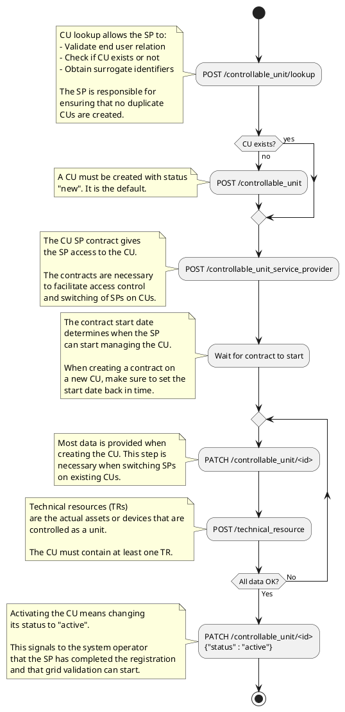

# Controllable Unit registration - API

This guide explains how a Service Provider (SP) can register a Controllable Unit
(CU) in the Flexibility Information System using the API.

The same steps apply when using the portal, but the user will be guided through
forms instead of API calls.

> [!NOTE]
>
> If you are looking for how to do it in the portal, check the [companion
> guide](../../guides/get-ready-for-market/sp-cu-registration.md). That guide
> also contains more detailed explanation of the steps and why they are needed.

## Resources and endpoints

Registering a CU involves creating and updating several resources in the FIS.

* [Controllable Unit](../../resources/controllable_unit.md)
* [Technical Resource](../../resources/technical_resource.md)
* [Controllable Unit Service Provider](../../resources/controllable_unit_service_provider.md)

In addition, [controllable unit
lookup](../../processes/controllable-unit-lookup.md) must be used to confirm that
the CU does not already exist and that the end user is linked to the accounting
point.

> [!WARN]
>
> CU lookup is mandatory when registering a new CU. Do not create a CU before
> confirming that it does not already exist.

## Steps to register a CU

The following diagram shows the steps that must be taken to register a CU. Where
neccessary, the steps are explained in detail with notes.

