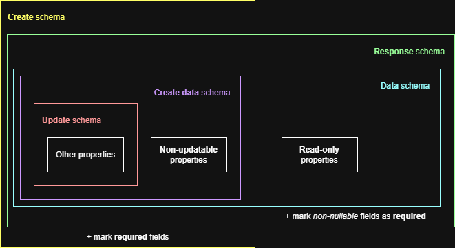
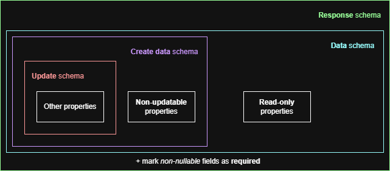

# Structure of JSON schemas in the OpenAPI documentation

The JSON schemas describing the resources in the OpenAPI documentation are
generated mainly from a custom YAML file describing the resources, with the help
of a script, so that we first maintain files expressed at a higher level than
the OpenAPI specification format.

We try as much as possible not to repeat ourselves in this document.
In particular, fields of a given resource should be defined only once, and if
fields are in common between several API endpoints, this should be reflected in
the use of _inclusion_ between the underlying JSON schemas.

This documentation helps the developer understand how the JSON schemas are
structured in the generated OpenAPI specification.

## Primer

In our resource YAML file, fields can be marked namely in the following manners:

| Marker        | Description                                                                                                                                                                                                |
| ------------- | ---------------------------------------------------------------------------------------------------------------------------------------------------------------------------------------------------------- |
| `x-no-update` | _Non-updatable_ field. Used for stuff that can/must be given on create, but that cannot be changed after. `x-` marker because this is non-standard OpenAPI and is just used during the generation process. |
| `readOnly`    | _Read-only_ field. Used for non-updatable fields that cannot be created by the API clients (_e.g._, automatically generated surrogate keys / UUIDs).                                                       |
| `nullable`    | _Nullable_ field.                                                                                                                                                                                          |
| `default`     | Field with a _default value_.                                                                                                                                                                              |

In addition, we define _required_ fields as the following:

> NOT read only
> AND NOT nullable
> AND NO default value
> AND NOT explicitely marked `required: false`

This allows not having to manually specify a `required` attribute everywhere,
and rather infer it from more meaningful information that we make explicit in
our resource YAML file.

## JSON schema structure

With the previous information, we can now show the structure of JSON schemas
generated by our script:

| Schema       | OpenAPI name                | Contains                                                                                                      |
| ------------ | --------------------------- | ------------------------------------------------------------------------------------------------------------- |
| **Update**   | `[resource]_update_request` | All properties _except_ the _non-updatable_ and _read-only_ ones                                              |
| **Create**   | `[resource]_create_request` | **Update** schema + _non-updatable_ fields + marking _required_ fields                                        |
| **Response** | `[resource]_response`       | **Create data** schema + _read-only_ fields (including audit) + marking all _non-nullable_ fields as required |
| **Data**     | `[resource]`                | Alias for **Response** schema                                                                                 |

Sometimes, there is no create operation for the resource.
In such cases, we simply do not generate the **Create** schema, so that the
OpenAPI linter does not reject our generated OpenAPI specification because of
unused schemas.
We still generally keep the base structure with **Update** and **Create data**
so the generation is more uniform across all resources.

