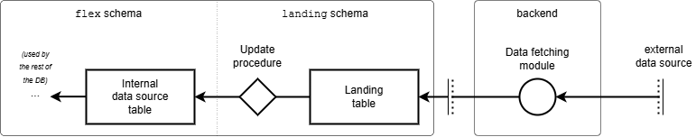

# Structure data from external sources

The FIS relies on some structure data that originate and is maintained
elsewhere/by other systems. The data is used for reference purposes and to
ensure consistency.

This data must be loaded by a compontent that is external to the FIS itself. The
reason for keeping this responsibility outside of the FIS is that depending on
what country/context the system is deployed in, the data may be sourced from
different places. Baking the synchronisation process into the FIS would tie the
system to a specific set of data sources, which is not desirable.

The structure data that must be loaded is summarised in the table below.

| Data                                   | Description/comment                                                 | Size (Norway) | Norwegian authority/source | Updates   |
|----------------------------------------|---------------------------------------------------------------------|---------------|----------------------------|-----------|
| Party                                  | Market participants (SP and SO)                                     | ~500          | Ediel                      | Manual    |
| Price Area                             | NO1-5 in Norway                                                     | ~5            | Statnett                   | Manual    |
| Metering Grid Area (MGA)               | Grid areas used in settlement, including SO and price area relation | ~500          | Statnett                   | Manual    |
| Energy Supplier Balance Responsibility | Balance responsibility of each ES, MGA and direction                | ~100k         | eSett                      | Automatic |

As you can see from the last column in the table, there are two different
strategies for _accepting data updates_: manual and automatic. These will be
described in more detail below, but lets first look at the general pattern.

## Pattern for synchronisation

When synchronising data, in general, we can distinguish between three different
technical approaches.

* `full` - The whole dataset is fetched and compared to the existing data.
* `delta` - Changes since the last synchronisation are fetched and applied to
  the existing data.
* `event-based` - Changes are sent as they happen, and the existing data is
  updated accordingly.

In addition to this, the full and delta approaches can be either `scheduled` or
triggered `ad-hoc` by users.

The FIS synchronisations only currently use the `full` approach, based on a
`scheduled` external mechanism. Other approaches will be added on an as-needed
basis.

All these structure data types are slow-moving, meaning that they do not change
very often. Synchronizing the data can be done on a nightly basis, and it is not
critical if the data is a few hours or even a day or two old.

Interdependencies among our resources (such as foreign key constraints) also make
bulk updates impossible to run without extra care to avoid introducing too many
inconsistencies.

## Strategies for accepting updates

We have two different strategies for _accepting updates_ into the system: manual
and automatic. We are picking the strategy based on the size and significance of
the data.

Common for both strategies is that we rely on an external component to fetch the
data and load it into the system, and that we have a process in place to update
the internal data source.

### Manual updates

For data that is not too big and whose updates are not too frequent, we rely on
a FIS operator to review the data and decide whether to accept it or not. The
operator is mostly in the loop to be informed, but can also do/request changes
to the data in upstream systems in case something is wrong. This is the case for
party, price area and MGA synchronisation.

For instance, party synchronisation is done manually by the appropriate users,
after they have received _notices_ about the inconsistency or out-of-sync state
to review and resolve, whereas balance responsibility is to be loaded
automatically every day by a background process.

TODO diagram - manual process - notice etc!

### Automatic updates

For data that is bigger and/or more frequently updated, we cannot rely on manual
review and acceptance. Instead we accept all updates and need to bake in safety
logic to ensure that we do not accept bad data/updates. The energy supplier
balance responsibility data is loaded with this strategy.

The automatic synchronisation process follows the architecture illustrated in
the diagram below:

On the left-hand side lies the _internal data source table_, which is the target
of the synchronisation process.
It is the table whose data will be used by the rest of the database as a trusted
source of information.

The key component of the pattern we implement here is the _landing table_,
representing a kind of intermediary step, splitting the data fetching and the
data update phases.
Data will first be loaded into the landing table, then an _update procedure_
will be followed to actually update the target table.
The landing table is a copy of the target table without the foreign key
constraints to allow storing "raw" data.
It is the update procedure's responsibility to ignore/fix/warn about wrong
records coming from the landing table.
The landing table still contains some format checks to ensure more data quality,
even though we trust the external source to some extent.

The last component is the _data fetching module_, lying outside of the database.
It is responsible for downloading the data via the API of the
_external data source_.
This module loads data into the landing table via an _interface_ (API or
views/procedures), so as to ensure decoupling and prevent assuming an internal
database structure from the outside, which makes us free to change the internal
details over time if needed.
