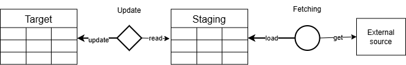
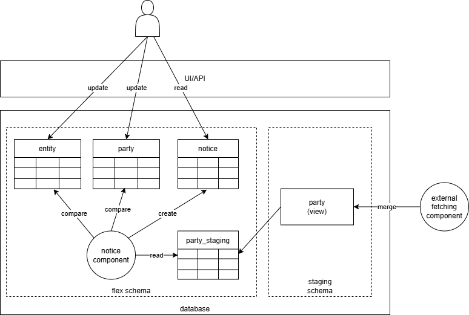
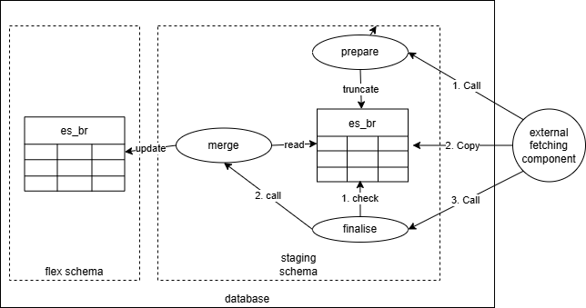

# Structure data from external sources

The FIS relies on some structure data that originate and are maintained
elsewhere/by other systems. The data is used for reference purposes and to
ensure consistency.

We call the process of getting this data into the FIS database
_synchronisation_. And we split this in two steps: _fetching_ and _updates_. The
diagram below shows a conceptual overview of the synchronisation process.

The left _target table_ is the target of the synchronisation process. It is the
table whose data will be used by the rest of the system as a trusted source of
information. The right _staging table_ represents a kind of intermediary step,
splitting the fetching and update steps.

Fetching is the process
of getting data from the external source and loading it into a staging
table. The updates functionality is responsible for comparing existing data
with the staging table and updating the target table accordingly.

The structure data that must be synchronised is summarised in the table below.

| Data                                   | Description/comment                                                 | Size in records (NO) | Authority (NO) | Loading | Update    |
|----------------------------------------|---------------------------------------------------------------------|----------------------|----------------|---------|-----------|
| Party                                  | Market participants (SP and SO)                                     | ~500                 | Ediel          | Merge   | Notice    |
| Price Area                             | NO1-5 in Norway                                                     | ~5                   | Statnett       | Merge   | Notice    |
| Metering Grid Area (MGA)               | Grid areas used in settlement, including SO and price area relation | ~500                 | Statnett       | Merge   | Notice    |
| Energy Supplier Balance Responsibility | Balance responsibility of each ES, MGA and direction                | ~100k                | eSett          | Replace | Automatic |

As you can see from the last column in the table, there are two different
strategies for _doing updates_: notice and automatic. These will be
described in more detail below, but let's first look at the general pattern.

## Fetching mechanism

This data must be fetched and loaded by a component that is external to the FIS
itself. The reason for keeping this responsibility outside of the FIS is that
depending on what country/context the system is deployed in, the data may be
sourced from different places. Baking the data loading process into the FIS
would tie the system to a specific set of data sources, which is not desirable.

Data is loaded into the staging structure with business identifiers from the
external data source.
It is the responsibility of the fetching component and staging structure to
ensure that the data is of the right format and quality.

### Getting data

When synchronising data, in general, we can distinguish between three different
technical approaches:

* `full` - The whole dataset is fetched and compared to the existing data.
* `delta` - Changes since the last synchronisation are fetched and applied to
  the existing data.
* `event-based` - Changes are sent as they happen, and the existing data is
  updated accordingly.

In addition to this, the `full` and `delta` approaches can be either `scheduled`
or triggered `ad-hoc` by users.

The FIS synchronisations only currently use the `full` approach, based on a
`scheduled` external mechanism. Other approaches will be added on an as-needed
basis.

All these structure data types are slow-moving, meaning that they do not change
very often. Synchronising the data can be done on a nightly basis, and it is not
critical if the data is a few hours or even a day or two old.

Interdependencies among our resources (such as foreign key constraints) also make
bulk updates impossible to run without extra care to avoid introducing too many
inconsistencies.

### Database interface

The data fetching component interfaces directly with the database to load the
data into the staging structure. We do this via dedicated views, procedures and
unlogged tables in a separate `staging` schema. This is to ensure decoupling and
prevent assuming an internal database structure from the outside, which makes us
free to change the internal details over time if needed.

## Loading mechanism

We use two different strategies for loading the data into the staging structure,
depending on the size of the dataset and the update mechanism we have in place.

### Replace

For bigger datasets, using the automatic update strategy, we replace the whole
dataset with the new one. This is largely for performance and simplicity. Since
the system does not rely on the data always being present in the staging tables,
this allows us to use unlogged tables, truncate and PostgreSQL copy command to
efficiently load the data.

### Merge

Datasets that are small and rely on the notice update mechanism depend on
having the data always available in the staging tables. We must use a merge
strategy for loading the data. This means that the fetching component must
update, insert, delete existing records in the staging table as needed.

## Update mechanism

We have two different mechanisms for _doing updates_ into the target tables in
the system: notice and automatic. We are picking the mechanism based on the size
and significance of the data.

### Notice

For data that is not too big and whose updates are not too frequent, we rely on
a FIS operator to review the data and decide whether to accept it or not. The
operator is mostly in the loop to be informed, but can also do/request changes
to the data in upstream systems in case something is wrong.

The operator is made aware of the updates via
[notices](../concepts/notification-and-notice.md#notice).

For instance, party synchronisation is done manually by the appropriate users,
after they have received _notices_ about the inconsistency or out-of-sync state
to review and resolve, whereas balance responsibility is to be loaded
automatically every day by a background process.

### Automatic

For data that is bigger and/or more frequently updated, we cannot rely on manual
review and acceptance. Instead we accept all updates and need to bake in safety
logic to ensure that we do not accept bad data/updates. The energy supplier
balance responsibility data is loaded with this strategy.

## Examples

The following two sections illustrate how the above mechanisms are used for two
of the structure data types we synchronise in the system.

### Party synchronisation

Party synchronisation is using the merge loading strategy and the notice update
strategy. The diagram below shows how this is done in the system.

### Energy Supplier Balance Responsibility synchronisation

Energy Supplier Balance Responsibility (ES BR) synchronisation is using the
replace loading strategy and the automatic update strategy.
The diagram below shows how this is done in the system.

