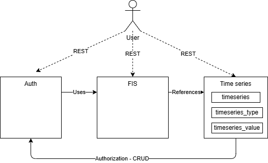

# Time Series Service Design

This document outlines details about the time series functionality in the
flexibility register.

> [!NOTE]
>
> This functionality is not yet implemented. It is a design that we will use in
> further development of use-cases related to time series data.

## Introduction

Given our [investigations into time series data](../concepts/time-series.md), we
believe that a flexibility information system needs to store and distribute time
series data. The first use cases that we are thinking of looking at are:

1. calculate and report imbalance settlement adjustments to eSett
2. enable end users to securely access their data in compliance with GDPR

> [!NOTE]
>
> It is not *given* that FIS will become a data administrator for timeseries
> other than accounting meter data. We do not know exactly what data will flow
> through FIS. This design is therefore a light-weight, general purpose starting
> point and conceptual design for a time series service using our existing
> stack.

## Design goals

* a general purpose time series design
* efficient storage of time series data in PostgreSQL
    * we need to learn more about the usage patterns and functional requirements
      related to time series data before we should consider other data store(s)
    * it will also likely take quite some time before we have enough data to
      warrant a change
* decouple time series as its own service/module for easier evolvement and
  possible replacement

### Requirements

* handling of both *point* and *interval* time series
* multiple types of time series data
    * *observations* - metered and measured values
    * *forecasts* - baselines
    * *schedules* - production and consumption plans
    * *prices* - spot and balancing prices
* updateable time series - to correct errors or update baselines closer to
  the operation time
* bi-temporal storage and audit - to support corrections and reconciliation
* prevent duplication of time series - to help avoid "double registration" of
  assets in the system
* support multiple time series for the same level and origin - to allow testing
  multiple baselines concurrently
* invidual access - no current use cases for large scale aggregation or
  calculations similar to settlement jobs in Elhub

## Limitations

* The OCI PostgreSQL service does not support
  [extensions](https://docs.oracle.com/en-us/iaas/Content/postgresql/extensions.htm)
  that allow for efficient column-major storage, such as Citus and TimescaleDB.
  We are therefore forced to use the row-major storage if we want to use this
  service.

### Non-Requirements

* no completeness check upon storage ("Channel Milestione" in Elhub term) -
  completeness checks will be handled by the consumer
* no period volumes

### Possible future needs

* calculations or formulas - the design should not shut out future
  calculations or formulas, but they are not in scope for the initial design

## Inspiration

The following list contains some names and concepts from some reference systems
we have looked at when thinking about time series data.

* Elhub
    * MeasurementDefinition and IntervalVolume on MeteringPoint
* CIM
    * IntervalReading/MeterReading of ReadingType on Channel of Register of Meter
    * MeasurementValue on Measurement on PowerSystemResource and Terminal
* NODES MeteringHub
    * MeterReadings on Asset, Accounting Point, Portfolio
* [Shyft](https://shyft.readthedocs.io/en/latest/content/time_series/concepts/time_series.html)
    * "*A time series in Shyft is considered to be a function of time, f(t) ->
      float.*"

## Design

We leverage the existing stack and way of doing things

* PostgreSQL for storage
* PostgREST to expose our restful API, but on a new path/api
* RLS for authentication

We model the timeseries as three resources.

* `timeseries` - the time series identifier limited metadata
    * will include the external identifier for the time series, partially to avoid
      duplication of time series in the system
* `timeseries_type` - a finite set of types of time series data. To avoid
  duplication information in the `timeseries` table. The fields are the
  "attributes" of the time series, *not* their "usage". Meaningthat we will e.g.
  record the unit, but not wether it is a schedule or metered value.
* `timeseries_value` - the values of the time series

### API

The relevant API actions will be

* `POST /timeseries` - create a new time series metadata
* `GET /timeseries` - list all time series metadata
* `GET /timeseries/{id}` - get a specific time series metadata
* `PATCH /timeseries/{id}` - update a time series metadata
* `GET /timeseries_value?timeseries_id={id}` - list all values for a time series
* `GET /timeseries_value?timeseries_id={id}&time={time}` - get a specific value
* `POST /timeseries_value` - add a timeseries value
* `PATCH /timeseries_value?timeseries_id={id}&time={time}` - update a value for
  a time series
* `DELETE /timeseries_value?timeseries_id={id}&time={time}` - delete a value
  for a time series

### Events or distribution

We can use our existing event system, but need to figure out a way to add a
reasonable amount of events. Cannot do event-per-value.

### History for bi-temporal storage

We will use the existing history concept and our `pg_audit` package to store
historic time series data.

### Efficient storage of values

To store the time series as efficiently as possible, we can use two strategies:

* store as little as possible
* use
  [column tetris](https://stackoverflow.com/questions/2966524/calculating-and-saving-space-in-postgresql/7431468#7431468)
  to ensure efficient storage. Se also
  [On Rocks and Sand](https://www.enterprisedb.com/blog/rocks-and-sand)

The biggest saving we can have is to avoid storing time ranges both for the
valid time of the interval and record time. We only store the record time and
the valid time start as a single `tstz`.

Our `timeseries_value` table will look something like this.

| Column Name     | Type        | Nullable | Size | Description                           |
|-----------------|-------------|----------|------|---------------------------------------|
| -               | Row header  |          | 24   | -                                     |
| timeseries_id   | bigint      | No       | 8    | Unique identifier for the time series |
| time            | timestamptz | No       | 8    | The time of the value                 |
| recorded_by     | bigint      | No       | 8    | The identity that recorded the value  |
| recorded_at     | timestamptz | No       | 8    | The time the value was recorded       |
| value           | bigint      | No       | 8    | The value of the time series          |
| quality         | smallint    | Yes      | 2    | The quality of the value              |
| validation_code | smallint    | Yes      | 2    | The history id of the value           |
| estimation_code | smallint    | Yes      | 2    | Whether the value is an estimation    |
| -               | padding     |          | 2    |                                       |

At a grand total of 80 bytes per row. It does not seem like much but storing a
measly 100k timeseries with an interval of 15 over a year will take up over 260
GB of storage.

> [!INFO]
>
> A `tstzrange` — range of timestamp with time zone - uses a variable lenght of storage
> depending on the presence of the lower and upper bounds. If both bounds are present.
>
> * No bounds: 6 byte
> * Lower bound only: 14 byte
> * Upper bound only: 22 byte

Notice that we are not including an `id` column. This allows us to save 8 bytes
per row, plus avoid having the automatically created primary key index. What
will we do instead? See below.

#### Indexing and primary key

We will use a covering index on the time series table, to speed up read and
update operations. By making it a unique index we can use it as a primary key.

```sql
CREATE UNIQUE INDEX timeseries_value_pkey
ON timeseries_value (timeseries_id, time)
INCLUDE (value);

ALTER TABLE timeseries_value
ADD CONSTRAINT timeseries_value_pkey
PRIMARY KEY USING INDEX timeseries_value_pkey;
```

Why?

1. Going to the heap takes time/io - including value is low overhead, but
  potentially saves a lot of time.
2. Indexes take up space and time to maintain. Using one index for both
  the primary key and the covering index saves space and time.

#### Numeric vs integer

The jury is out. Int is a good choice for exactness, but numeric is good for its
`varlena` storage.

PostgreSQL docs on
[numeric](https://www.postgresql.org/docs/current/datatype-numeric.html) states

> The type numeric [...] is especially recommended for storing monetary amounts
> and other quantities where **exactness** is required. Calculations with numeric
> values yield exact results where possible, e.g., addition, subtraction,
> multiplication. However, calculations on numeric values **are very slow** compared
> to the integer types, or to the floating-point types described in the next
> section.

#### Partitioning

Possibly weekly. Will be decided at a later time, when we have a better
understanding of the volumes and access patterns.

## Integration

The integration with the rest of the system will happen as shown below. This is
a conceptual drawing of the integration. The main point is that the time series
service will not reference the main FIS module, only the other way around. This
is to decouple and make it independent of the FIS application.

When we create our data model in FIS, we will reference the time series by id.
When seen from the time series service, it will not have any knowledge of what
the time series are used for, just what they look like and their values.

The time series have very different technical requirements than the flexibility
information system, such as volume and access patterns. It is also likely that
it demands a different pattern for integration and technical foundation than the
rest of the FIS.



Future external interfaces might also include

* bulk endpoints for large datasets - with asynchronous processing
* mqtt or simliar interfaces for real-time updates
