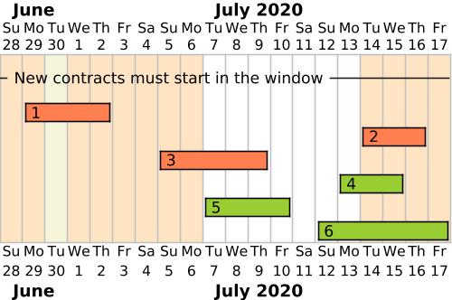

# Time

This section describes how we handle time in the Flexibility Information System.

## Clusivity in intervals

In general, all time ranges are _half-open_ intervals. This means that the start
time is inclusive and the end time is exclusive. This is also known as
[left-closed right-open](https://en.wikipedia.org/wiki/Interval_(mathematics)).

We follow the
[notation used in the PostgreSQL range type](https://www.postgresql.org/docs/15/rangetypes.html#RANGETYPES-IO).
This means that the convention we follow is `[start, end)`. `null` means
unbounded, and only the upper bound can be unbounded.

## Bi-temporal data

For a good primer read this article on
[bi-temporal history on the Martin Fowler blog](https://martinfowler.com/articles/bitemporal-history.html).
We are using the bi-temporal data model to store and make available the data in
the flexibility information system. With that model, we can answer questions
like:

> Who did we have as the service provider for controllable unit X on 2021-01-14
> **as of** 2022-03-01?

!!! Note "Bi-temporal only when needed"

    Not all data in the system is bi-temporal. We generally provide history
    (record time) on all resources, but only some data (that needs it) have valid
    time timeline.

The following sections outline how we think about and implement
bi-temporal data.

### Record time

One of the requirements in NCDR is that the Flexibility Information System
should be able to provide "historic" data for the resources in the system. This
means that we need to be able to provide data that was valid at a certain point
in time. We understand this to be related to the **append-only history** of when
the data was recorded, updated and replaced in the system. In temporal data
modelling we call this time axis _record time_. A common concept related to
record time is to be able to provide data **as of** a point in time.

!!! note "Other names for record time"

    There are other names for this time axis, such as _transaction_ or _system_ time.

Record time is typically implemented using a time range.

| Bound | Clusivity | Name              | Alt name    |
|-------|-----------|-------------------|-------------|
| Lower | Inclusive | Record time start | Updated at  |
| Upper | Exclusive | Record time end   | Replaced at |

### Valid time

The other time axis we deal with is _valid time_. This can for example be when a
contract is valid, or when a party is a member of a market. This time axis is
related to the **timeline** of the data itself. When we say that something is
**time-dependent**, we talk about the valid time timeline.

!!! note "Other names for valid time"

    This time axis is also commonly referred to as _application_, _actual_, _business_ or _effective_ time.

Valid time is typically implemented using a time range.

| Bound | Clusivity | Name             | Alt name   |
|-------|-----------|------------------|------------|
| Lower | Inclusive | Valid time start | Valid from |
| Upper | Exclusive | Valid time end   | Valid to   |

!!! note "Midnight alignment"

    We represent valid time as _midnight-aligned_. This constraint allows
    planning and performing operations more easily. However, we still store full
    timestamps for uniformity and to allow exceptional updates. This means that
    insert/update operations on the API should always have their valid time
    values aligned with the Norwegian midnight.

### Frozen timeline

The timeline of some contracts can be _frozen_ for some roles in the system.
This means that the part of the past that is older than a given _time interval_
from now is a _frozen past_ where nothing can be _added or edited_.

The diagram below shows the example of a contract resource whose timeline is
frozen after a week. Frozen contracts or parts of contracts are shown in blue,
and non-frozen in green. Orange is used for errors / unacceptable contracts.

Creating a new contract (number `4`) in the past can only be done in the
non-frozen past. In the diagram, only the second proposal (`4''`) is acceptable,
both others overlapping with frozen time partially or fully.

The frozen past cannot be edited, meaning that updating a contract (number `5`)
cannot change its start date if it is already in this frozen past. The two first
updates in the diagram (`5'` and `5''`) are therefore invalid, even though the
second one puts the contract in the non-frozen past. The start date of contract
`5` is simply frozen and cannot move.

The end date of this partially frozen contract can be moved anywhere in the
non-frozen past, so the third update (`5'''`) is invalid, but the last one is.

### Timeline window

For some contracts, _insertion_ can be restricted to a fixed _window_ from the
current time. This means that new contracts can only _start_ in this interval.

The diagram below shows the example of a contract resource with a timeline
window of one week placed one week ahead of time.

In this example, all contracts created on 30.06 must start between 07.07 and
13.07. The two first contracts are invalid, but the three last ones are valid,
regardless of their end date.

## Timezones

In the context of storing datetime-related information, a timestamp only has
meaning if it is considered in a given timezone.

### Storage format

Datetime data is stored in the system in the standard [ISO 8601](https://en.wikipedia.org/wiki/ISO_8601)
format (date + time + timezone), so that information in the database is complete
and does not depend on any user configuration.

### Time in the user interface

As the Flexibility Information System is expected to only handle data related to
the Norwegian flexibility market, it makes sense to use Norwegian time. This
means both displaying dates in Norwegian format (`DD.MM.YYYY` and 24-hour time)
and in the Norwegian timezone (CET in winter, CEST in summer).

However, as the system is only a prototype, we do not want to roll our own
mechanism to compute timezone offsets and we keep things simple. Therefore, we
assume that our test users will use the software from the area using the
Norwegian timezone, so times are displayed in the browser's local timezone. If
a user is accessing the system from abroad, it is advised to change the
browser's timezone to the Norwegian one, so that the data displayed keeps making
sense.

We also use default datetime input components that do not handle the
specificities of seasonal transitions between time offsets happening in Norway
(gap of an hour when transitioning from winter to summer, duplication of an
hour when transitioning from summer to winter). Any information entered around
the times these transitions happen is not particularly checked and we are
relying on whatever default behaviour of the browser's datetime API. This may
change in a production setting but we are delaying this effort to later.
