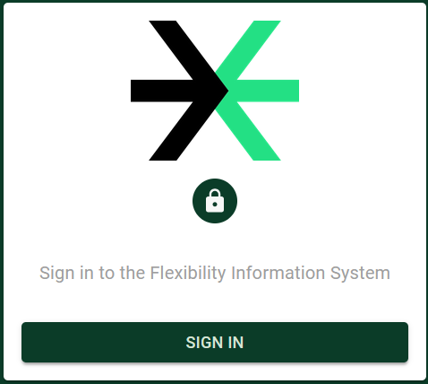

# Getting started

This page contains some help to get started using the Flexibility Information
System Portal.

## Authentication

Prior to any other possible action, you must authenticate in the portal.
The only page you can access as an anonymous user is the login page,
automatically showed the first time you reach the URL where the system
is hosted.

When you click on the `SIGN IN` button, you will be redirected to and external
identity provider at Oracle Cloud Identity and Access Management (IAM) to
authenticate.

Here, you must enter your _credentials_. These are the _test credentials_ you
have received by e-mail from us. The username is a fictive personal id
(fødselsnummer) and the password is what you created when you activated the
account. Once done, you will be redirected back to the portal as an
authenticated user.

## Assume a party

Once logged in, you can access to the _dashboard_, a welcome page containing
some important information and links, but you can also access the documentation
for instance, and the _Assume Party page_, which is where you will be redirected
by default after logging in :

On this page, you must choose a party in the list and click
`ACT ON BEHALF OF THIS PARTY`. Finally, you will be redirected to the
_dashboard_.

For more detailed information about authentication, please head to the
[dedicated documentation page](../auth.md).

## User interface of the Flexibility Information System

Here is an example of resource page on the information system :

The user interface of the system is organised as the following :

### 1. Navigation menu

This menu can be used to switch between the various resources you may want to
interact with.

### 2. Breadcrumbs

This component is here to help you identify better where you are currently
standing in the hierarchy of the information system, and allow you to jump back
to the parent pages by clicking one of the links in the chain.

### 3. Resource information

This section can vary according to the type of page you are looking at. The
example page is listing some records, but other pages allow creating, viewing or
editing individual records.

### 4. User menu

This menu is there to remind you of who you are logged in as, and which
party you are acting as. The party can be changed by clicking on the
right-most component and going back to the _Assume Party page_.
